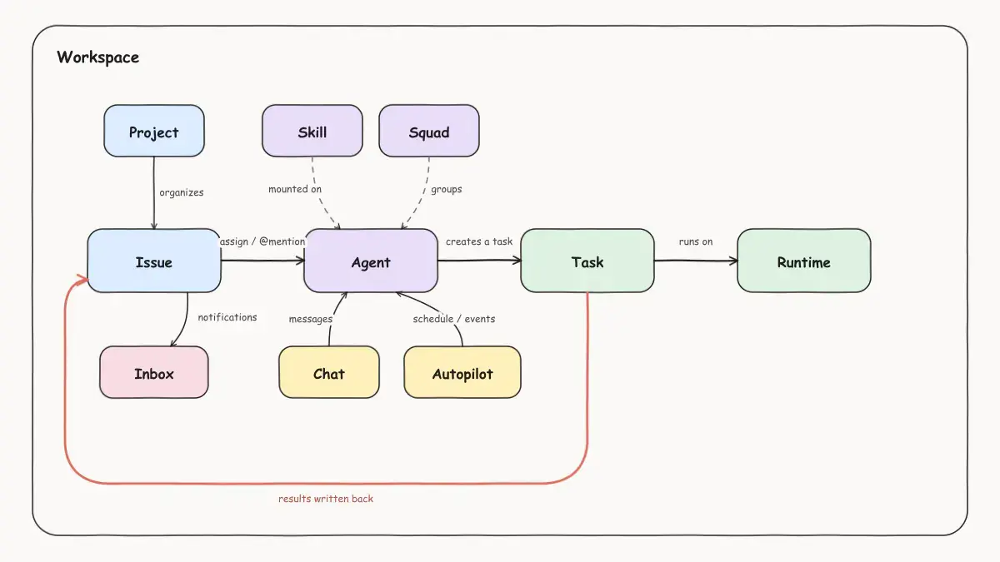

# Multica 调研

## 概况

- **公司**：Multica AI，创始人兼 CEO 张佳圆（Jiayuan Zhang，GitHub forrestchang，LinkedIn 在香港）。此前做 devv\.ai（AI 开发者搜索）。GitHub 组织另有 andrej\-karpathy\-skills 仓库 21\.5 万 star，是他们最大的流量入口

- **时间线**：仓库 2026\-01\-13 建，v0\.1\.0 2026\-03\-22 发布，到 2026\-09\-21 v0\.5\.1 共 124 个版本，几乎每个工作日发版

- **规模**：5\.1 万 star、6\.6 千 fork、328 贡献者、5433 次提交、1655 个开放 issue。5 月初还是 2\.6 万 star，四个月翻倍

- **定位**：“你的下 10 个雇员不是人。” 把编码 Agent 当队友放到任务板上；自称是“开源版的 ChatGPT workspace agents”

- **技术栈**：Go 后端（Chi、sqlc、WebSocket）\+ PostgreSQL 17，Next\.js 16 前端，Electron 桌面端，Expo iOS，daemon 和 CLI 是同一个 Go 二进制。约 120 张表、537 个迁移

- **许可证**：“Multica License”：Apache 2\.0 全文加附加条件。未授权不得作为托管服务提供给第三方（免费也不行）、不得嵌入商业产品、不得去品牌；只用后端或 CLI 也要署名。组织内部自用不受限。**结论：不能复用它的代码，可以读**

- **商业模式**：云端（multica\.ai，免费试用 \+ Talk to sales，定价未公开，有 issue 数和 Autopilot 次数配额）、Stripe 积分制计费页还是半成品、Cloud Runtime 在等候名单。自托管免费

- **自举**：创始人在 X 上说 Multica 自己的 Agent 已是仓库第一贡献者。提交信息全是 `MUL-xxxx` 工单号

## Workspace

Multica 的最上层边界，成员、任务、项目、智能体、skill 和执行记录都属于某一个工作区，彼此隔离

## Agent

Multica 的 Agent 是一种身份（有点类似于“岗位”的概念），Runtime 是执行它的电脑。在 Multica 里可以自定义很多 Agent，一份 Agent 配置里有：

**Agent 怎么开始干活**：靠 Multica 建一条 Run 给它。Multica 建一条 Run，守护程序就在绑定的电脑上按 Agent 的配置启动一次 CLI 进程，带上它的指令和技能。进程结束，Agent 又回到“只是一份配置”的状态。它没有常驻记忆，靠会话续接和 Issue 记录保持连续。

**举例，一个 Agent 名叫 Mika，什么时候触发新 Run 给 Mika？（列表不全，大概有个概念）**

1. **指派 Issue：**把 Issue 的负责人设为 Mika 或者 Mika 带领的 Squad

2. **在 Issue 里评论：**评论里 @Mika 或 Mika 带领的 Squad（评论里可以 @ 任何 Agent 或 Squad）

3. **聊天：**在 Chat 里给 Mika 发消息

4. **平台事件：**Mika 负责的 Issue 的某一批次子 Issue 全部完成

## Squad

Squad 是 Multica 里的“小队”，即一个标记为`leader`的 Agent 带领若干成员。它解决“这条 Issue 该给谁”在建单时说不清的问题。

**怎么跑**

1. 把 Issue 指派给 Squad“CRM 团队”。平台只唤醒 leader，不动成员。

2. leader 拿到一份系统附加的简报：不可编辑的“小组操作协议”（只分派不干活、用精确的 @ 格式委派、每轮记一条评估、分派完就停）、成员名册、你写的小组指令。

3. leader 发一条评论 @Engineer“你做登录”，然后结束本轮。这条 @ 唤醒 Engineer。

4. Engineer 做完发评论回报，平台再唤醒 leader（就是刚才说的回路）。leader 决定下一步：再派、@Reviewer、或者确认目标达成把 Issue 改成 in\_review。

5. done 留给人。

**它不是什么**：不是把几个 Agent 合成一个大 Agent，也不会提高并发。成员之间不直接沟通，全部经过 leader 的评论路由。leader 守不守协议全靠提示词，平台只在事后记录它每轮的评估。

## Skills

工作区统一管理，手写或导入md文件。

**怎么用**：在 Agent 配置里勾上，一个 Skill 可以挂给多个 Agent；daemon 每次执行前把勾选的技能写进工作目录的 `.claude/skills/` 或 `$CODEX_HOME/skills/`，Agent 按需自己读，不占前置 token。挂在 Agent 上的技能可以单独禁用。

## Project

一组 Issue \+ 描述（注入 Agent 上下文）\+ 资源（GitHub 仓库或某台机器的本地目录）

项目知识沉淀主要靠 Git 和 CLI 的原生机制：

- 仓库里的 CLAUDE\.md 或 AGENTS\.md

- 仓库里的 docs/

- 仓库里的 \.claude/skills/

Multica 提供另外两层：

- 项目描述（每次注入）

- 工作区 Skills（按 Agent 挂）

## Issue

Issue（任务）是 Multica 实际的工作单元。

### **状态**

7 个状态，归类到 4 个生命周期：

⚠️ 状态之间没有固定的顺序流转，人和 Agent 都能随时改成任何值。daemon 启动 Agent 之前写进 `AGENTS.md`的规范只有：

> 交付了 Issue 要的东西、等验收 → `in_review`；`done` 留给人。工作还要继续、派了子 Issue → `in_progress`。缺东西做不下去 → `blocked` 并留言。这一轮只是回答问题、没产出 Issue 的交付物 → 什么都不写。
> 
> 

Multica 只在三种情况改状态：Run 失败退回 todo、带 Closes 的 PR 合并置 done、Autopilot 同步。

支持自定义状态：在固定的 4 个生命周期下，自定义状态，

- 为什么有？Multica 的 Issue 没有阶段/流水线的概念，状态是唯一能表达“做到哪一步”的东西。每个团队流程不一样，有人要 QA 一站，有人要设计评审一站

- 坑：要让 Agent 用自定义状态，得在 Agent / Squad 指令里写规则，比如“测试跑完把状态改成 QA，不要改 in\_review”，但 Multica 本身不能保证 Agent 照做

### 父子关系

**示例：**

假如**「PIPA\-1 \- 实现一个简单的CRM」**这个 Issue 指派给 Agent Mika，Mika 是直接开始写代码，还是拆成若干子 Issue，取决于 Mika 设置里的指令里怎么写。默认的 Mika 是工作区首要员工，它的内置指令里有“**被指派了 Issue 时，直接执行那个 Issue**”，所以 Mika 的大概率不拆子 Issue。

如果指派给另一个自定义 Agent，并且指令明确说“大活拆子 Issue”，它可能会拆分：

1. PIPA\-2 搭项目骨架（Stage 1）

2. PIPA\-3 登录（Stage 1）

3. PIPA\-4 客户列表（Stage 2）

4. PIPA\-5 联系人（Stage 2）

5. PIPA\-6 商机（Stage 3）

5 条子 Issue 都独立跑，有自己的负责人、状态、运行记录，它们的“父 Issue”字段都指向 PIPA\-1，PIPA\-1 页面会多一个子 Issue 列表。

**Stage** （子事项分批）只是一个数字标签：

- Multica 不会因为 Stage 1 的存在就阻塞 Stage 2/3，除非建子 Issue 时把 Stage 2/3 的状态设成 backlog。但这并不是 Multica 的默认/确定行为，也要写入 Agent 指令，比如“子 Issue 之间有先后关系时用 Stage 分批，后批放 backlog；没有先后关系时不要用 Stage”

- 不管 Stage 2/3 开始的状态是 backlog 还是 todo，所有 Stage 1 完成时都会唤醒父负责人

    - 如果 Stage 2 是 backlog，父负责人把 Stage 2 的从 backlog 变成 todo

    - 如果 Stage 2 早就在跑了，就只是告知父负责人 Stage 1 完成了

5 条子 Issue 全完成后，PIPA\-1 不会自动变 done，要人或 Agent 手动改。

### 负责人

负责人是个单值，三选一：

- 一个 Agent 可以同时跑多条 Issue，上限是它配置里的并发数，默认 6

- 一条 Issue 上可以同时有多个 Agent 在跑，只要是不同的 Agent：比如负责人 Engineer 在跑，你可以在评论里 @Reviewer，Reviewer 也会开一条自己的 Run，两条并行，各自在自己的工作目录里。它们互相看不到对方的改动，只能通过评论交流

- 想让多个 Agent 一起做一条 Issue，只有两条路：指派给 Squad 让 leader 分，或者在评论里 @ 多个 Agent

### 优先级

- 紧急/高/中/低

- 影响只有一个：排队时先领高优先级的

### Activity

Issue 页面最主要的内容是 Activity，把这条 Issue 上发生过的所有事按时间排在一起，人和 Agent 的动作混排，包括：

### 文件

Multica 里 Agent 产出的文件有三个去处，都不是“文档对象”：

所以“先给我看需求文档再动手”在 Multica 里是这样：

- 你在 PIPA\-1 描述里写“先出需求文档，发评论给我确认，确认前不要写代码”

- Mika 跑一次，发一条长评论

- 你在评论下回复意见（可以选中文字做批注）

- 它再发一版；你回“可以”；它继续。

全程靠评论和你的提示词，平台不知道“这是需求文档”“这是第二版”“已经定稿”。原型也一样，要么发一个 HTML 附件让你在桌面版里点开，要么推到仓库。

### 人如何协作

- **说话**

    - 评论：发在时间线里，所有订阅的人收到收件箱通知。可以回复某条形成线程，线程能标 Resolve，也能把某条回复标为结论。

    - @ 人：通知他，不触发 Agent。@ Agent 才会让 Agent 跑。`@all` 通知所有人，同样不含 Agent。

    - `/note`：纯备注，谁也不通知、谁也不触发。

    - 批注：选中描述或评论里的一段文字，加引用和备注，最多 20 条，作为一条评论发出。

    - 表情反应、复制某条评论的永久链接。

- **改东西**

    - 右栏属性直接改：状态、负责人、优先级、日期、项目、标签、自定义属性。改了会记进时间线。

    - 描述是富文本，两个人同时改会提示冲突并显示差异对比，不静默覆盖。

    - 从评论“创建子 Issue”，来源文字会被快照。

- **分工**

    - 负责人只能一个，人或 Agent。其他人想参与就评论，或者被拉成订阅者。

    - 订阅：创建人、负责人、评论过、被 @ 过的自动订阅，也可以手动订阅或退订；订阅决定谁收通知。

    - Quick Actions：工作区预设的按钮，点一下等于发一条 @ 某 Agent 的固定评论，比如“让 Reviewer 审”。

- **看**

    - 在 Activity 看过程，执行日志看 Agent 的每次 Run，PR 卡片看 CI 和可合并性

    - 轮到自己的事会在 Multca 的收件箱收到提醒

- **没有的：**没有“审批”对象，没有“指派给我确认”这种动作。人对 Agent 交付的认可就是把状态改成 done，或者在 GitHub 上合并 PR。

## Autopilot

Autopilot 是定时或被外部事件触发的 Agent 任务，用来做那些不该等人来提的重复工作。一个 Autopilot 有:

**典型用法**，它自带六个模板：每日新闻摘要、PR 审阅提醒、Bug 分诊、周报、依赖审计、文档检查。比如“每天早上九点让 Engineer 检查依赖有没有新版本，有就建 Issue”。

**规则**

- 定时触发用标准五段 cron，页面会预览接下来几次。

- webhook 收到 JSON 就跑，payload 交给 Agent；建 Issue 模式下还会附在描述里。GitHub 的事件可以按 event 和 action 过滤。

- 七天内跑了 50 次以上且失败率超过 90% 会自动暂停并通知创建者。

- “只跑”模式失败不自动重试，避免和下一次定时重叠；“建 Issue”模式走普通 Issue 的重试规则。

- 云端有次数配额。

## Chat

Chat 是不脱离特定 Issue 的一对一对话，可以选择和哪个 Agent 聊。

**特点**

- 每个 Agent 一个会话，私密，只有你看得到。

- 每发一条消息就是一次 Run，跑在这个 Agent 绑定的电脑上，续接同一个会话，所以它记得前面聊的。

- 可以给会话挂一个项目，Agent 就带着项目描述和仓库信息；也可以在消息里 @ 某条 Issue，让它去读那条。

- 飞书、钉钉、Slack 的机器人也是走 Chat。

**边界**

- Agent 只答不干活：不 checkout 仓库、不改代码、不产出交付物。要干活要建 Issue

- 聊天不会自动变成 Issue，得 Agent 或你主动建。

- 聊天记录不进任何 Issue，不进其他 Agent 的上下文。聊出来的结论要自己写回 Issue，否则别人看不到。

**适合什么：**问问题、快速试一试某个 Agent 的路数、让 Agent 把一段模糊想法整理成 Issue

## Inbox

给人看的通知中心。

**会进 Inbox 的**

- 有 Issue 指派给你、取消指派、换负责人

- 你订阅的 Issue 有新评论、改了状态、改了优先级或日期

- 有人 @ 你，给你的评论加表情

- Agent 的 Run 失败、Agent 报 blocked、Agent 交付等你验收（review\_requested）

- 一句话建 Issue 的结果

- Autopilot 被自动暂停或超配额

**规则**

- 同一条 Issue 的多条通知合并成一条，点进去到那条 Issue。

- 可以标未读、归档，一键归档所有已完成 Issue 的通知。

- Issue 进 in\_review 或 done 后，它的失败通知自动归档；blocked 的例外，因为活还卡着。

- 设置里六组开关决定哪些进 Inbox。

- 订阅关系决定你收不收：创建人、负责人、评论过、被 @ 过的人自动订阅，可以退订。

**它不是什么**：不是待办清单。里面没有“要你做的动作”这种对象，一条“等你验收”的通知和一条“有人评论”的通知长得一样，都是点进去看 Issue。轮到你拍板的事和只是通知你的事混在一起，这是他们 UI 上被人诟病的地方

## 架构与执行机制

### 边界

平台只存状态、配置、Run 记录；代码、CLI、凭据在用户机器上。**例外**：Agent 的 custom\_env 和 MCP 配置存在服务端，执行时下发。

### 服务端调度

- 全靠 PostgreSQL：唯一索引去重（同 Issue 同 Agent 同线程只有一个 pending）、`FOR UPDATE SKIP LOCKED` 认领、45 秒准备租约、CAS 式完成。Redis 只做缓存。

- WebSocket 推送唤醒，daemon 用 WS\-RPC 认领，HTTP 兜底。心跳 15 秒，150 秒无心跳标离线。

- 离线宽限 3 小时；在跑的任务只要心跳还在就不会被墙钟杀；running 9000 秒且心跳过期才判失败。

- 失败原因约 30 个，分平台侧和工具侧；只有瞬时故障自动重试（最多 2 到 3 次）；会污染会话的失败强制开新会话。

- 评论合并：运行中来的新评论先登记，完成后补发一次后续运行。

- 归因分两个字段：originator（授权）和 accountable（审计和成本），Agent 调 Agent 时按链路顶端的人判权限。

### daemon 执行

- 先占本地槽位再批量认领，避免服务端 dispatched 而本地没容量。

- 每个 Issue 一个环境目录，后续 Run 复用工作目录和会话。

- 仓库不预先 checkout，由 Agent 执行 `multica repo checkout`，daemon 从 bare 缓存开 worktree，分支 `agent/<agent>/<task>`。本地目录模式可原地或 worktree，原地按路径串行。

- **所有 CLI 都以无人值守、自动放行权限启动**：claude `--permission-mode bypassPermissions`，cursor `--yolo`，opencode `--dangerously-skip-permissions`，copilot `--allow-all`，codex `danger-full-access`。官方安全模型明说“没有沙箱，边界是 daemon 的 OS 用户”。

- 没有迭代上限，墙钟默认不限，只有 2 小时空闲看门狗。

- PR 由 Agent 自己用宿主机的 `gh` 创建，daemon 不保证一定有 PR。

- 输出每 500 毫秒攒批上传，上传前本地正则脱敏；终态回报先落盘再发，断线重放。

- Git 身份按 worktree 隔离，缺身份宁可报错不沿用。

### 提示词

两层，为 prompt cache 设计：

- **运行时简报**写进工作目录的 CLAUDE\.md 或 AGENTS\.md（标记块，不覆盖用户内容）：Agent 身份和指令、工作区上下文、CLI 速查、仓库和项目、工作流（按任务类型分支）、技能索引、交付规则。

- **每轮提示**是 user message：任务类型、handoff note、建议先执行的读取命令、触发评论原文、状态增量。

- **不内联 Issue 正文和评论**，给 Agent 精确的 CLI 命令让它自己拉。

- Agent 回写只能通过 `multica` CLI，用每任务签发的 `mat_` 令牌，写操作归属到该 Agent。

### 复杂度

`task.go` 8 千行、`daemon.go` 1 万行（`runTask` 一个函数 1450 行）、`comment.go` 4 千行、`codex.go` 4 千行。`agent_task_queue` 约 70 列，同时承担 6 种任务语义。评论路由有 6 到 7 层回落。这和同事那套代码的形态一模一样：都是 Agent 快速迭代、按工单修补堆出来的。

## NocoProject 限制

- Agent 不允许 @ Agent，但人可以 @ Agent

- 去掉小队

- 用不同工作流明确任务阶段，以及限制 Agent 之间的工作派发

## NocoProject 改进

- 支持创建服务器资源，公共agent（有权限、资源限制）

- 支持切换实时会话模式

- 知识库

- 权限

- 工作流

