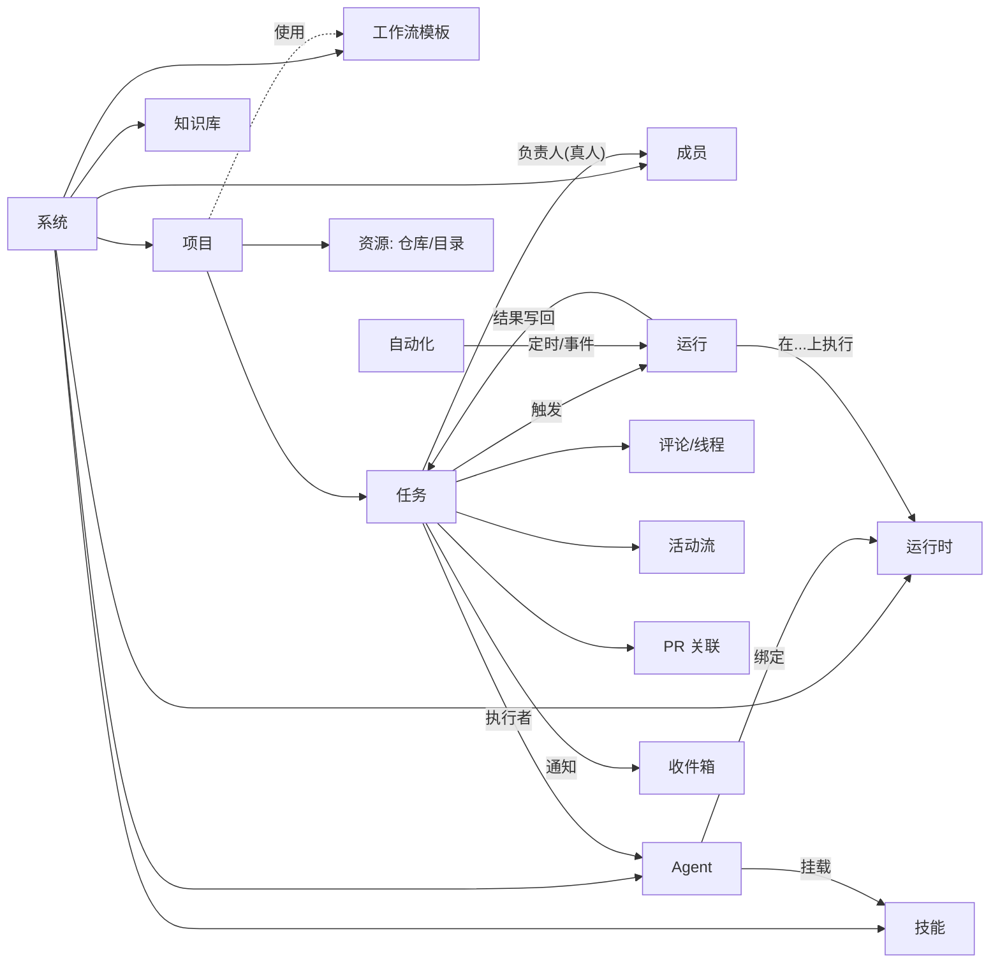
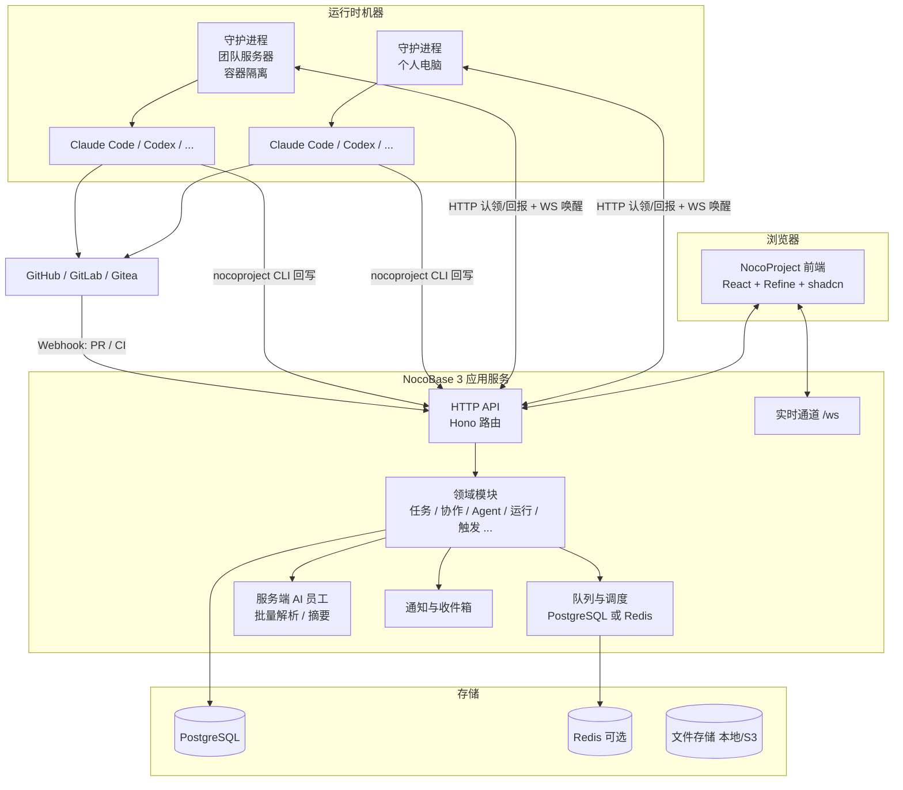

# NocoProject 产品与技术方案

> 版本：v0.6，2026-09-27
> 依据：《Multica 调研》、Multica 仓库（v0.5.x，只读，不复用代码）、NocoBase 3 应用模板与 19 份底座技能文档
> 阅读建议：第 1–3 章是产品层，不需要技术背景；第 4–6 章是技术层，供研发评审；第 7 章是已定决策与待办；第 8 章是临时实现清单。
> 同步规则：本文档是唯一来源，网页版由 `scripts/build-doc.mjs` 从本文件生成，每次修改后重新生成并发布。

### 修订记录

| 版本 | 日期 | 变化 |
|---|---|---|
| v0.1 | 2026-09-27 | 首版讨论稿 |
| v0.2 | 2026-09-27 | 落实九项决策：全栈 TypeScript、首批工具增加 OpenCode、多工作区分阶段、去掉独立聊天、Agent 自派子任务改为任务属性、服务器运行时默认容器、开源许可、CLI 命名；新增第 8 章"临时实现清单"，标记工作流审批、活动流与变更事件两项为临时实现，待替换为 NocoBase 官方能力 |
| v0.3 | 2026-09-27 | 去掉工作区概念，一套系统管理多个项目，隔离靠项目；新增 2.6 节详细说明 Agent 拆解子任务后的依赖、并行与协调机制；Agent 之间的派活从"禁止"改为"受限委派"：默认需负责人确认，可按 Agent 配置直接委派名单，也可由工作流阶段动作预设 |
| v0.4 | 2026-09-27 | Phase 0 技术验证完成：三个风险全部跑通，结论见 6.1 节；4.6 节认领协议补充按运行时的事务级咨询锁；4.7 节记录 OpenCode 的两个真实坑 |
| v0.5 | 2026-09-27 | Phase 1 迭代 1（协作骨架）交付并联调通过，见 6.2 节 |
| v0.6 | 2026-09-27 | Phase 1 迭代 2（交付链路）交付并联调通过，见 6.3 节 |

---

## 0. 一页总览

**NocoProject 是什么**：基于 NocoBase 3 的"人与 Agent 协同"的项目管理产品。人定方向、拍板、验收，Agent 在开发者的电脑或团队服务器上跑编码工具（Claude Code、Codex 等）把任务做出来，全过程记录在任务上。第一阶段服务软件开发团队。

**和 Multica 的关系**：交互流程、对象模型、执行机制绝大部分复刻 Multica；在四件事上有意不同：

| 维度 | Multica | NocoProject |
|---|---|---|
| 责任归属 | 负责人单值，可以是人、Agent 或小队 | 每条任务必须有一个真人负责人，Agent 只是执行者 |
| 谁能唤醒 Agent | 人、Agent、小队 leader、自动化都可以，Agent 之间可以互相 @ | 只有人和人配置的规则能唤醒 Agent；Agent 之间的派活是受限委派：默认要负责人确认，或走人预先配置的名单与规则 |
| 组织边界 | 多工作区 | 一套系统管理多个项目，隔离靠项目 |
| 任务阶段 | 7 个状态自由流转，靠提示词约束 Agent | 项目级工作流定义阶段、谁能推进、进入时做什么，服务端强制 |
| 运行时 | 只有个人电脑 | 个人电脑 + 团队服务器（公共、有配额、可容器隔离） |

**新增能力**：批量录入由 AI 解析、公共 Agent、实时会话模式、知识库、更完整的权限。

**技术基调**：服务端、前端、守护进程与 CLI 全部 TypeScript；复用 NocoBase 3 底座的认证、权限、通知、队列、调度、服务端 AI、文件、实时通道；自建任务领域模型、调度协议、守护进程、CLI 适配器。从第一天按领域拆模块，避免 Multica 的万行文件和 70 列大表。工作流审批、活动流与变更事件两项 NocoBase 正在开发，NocoProject 先做临时实现并隔离在接口后面，官方能力发布后替换（第 8 章）。

**开源**：Apache 2.0 加自定义附加条款（与 Multica 类似：禁止未授权托管转售与去品牌）。

**节奏**：技术验证 3 周 → 内部可用 MVP 约 10 周 → 对外发布 1.0 再约 10 周。

---

## 1. 定位与原则

### 1.1 一句话定位

让一个几个人的开发团队，带着一队 Agent，做出二十个人的推进速度，而每一件事都有人负责、有据可查。

### 1.2 目标用户与场景

- 首发对象：使用 NocoBase 的软件团队（包括我们自己），5 到 50 人，已经在用 Claude Code、Codex 等编码工具。
- 典型场景：产品经理批量录入一批需求，Agent 解析成任务；开发者作为负责人把任务交给 Agent 执行，在任务里评论指导；Agent 提交 PR，人评审合并，任务自动进入验收；团队服务器上的公共 Agent 承接巡检、周报、依赖升级等重复工作。
- 后续扩展：NocoCRM、NocoIASM 等方案会复用"Agent 执行运行时"这一层，因此这一层要做成与任务领域无关的独立模块。

### 1.3 六条产品原则

1. **人负责，Agent 执行。** 任务的负责人永远是真人；Agent 的交付要人验收；`done` 只能由人写入。
2. **人是唯一的触发源。** Agent 开始工作，一定能追溯到某个人的动作或某个人配置的规则。Agent 想让另一个 Agent 干活，必须经过人的确认或人预先配置的授权。
3. **阶段是明确的。** 任务当前处在哪一步、谁该推进、下一步是什么，由项目工作流定义，不靠提示词祈祷。
4. **一切在任务上留痕。** 描述、讨论、Agent 的每一次运行、PR、状态变化都挂在同一条任务上；聊天不是记录。
5. **代码不出门。** 平台只存任务、配置、运行记录；代码、工具凭据留在运行时所在的机器上。
6. **可靠优先于花哨。** 每一个自动行为都有明确的失败语义、重试规则和可见的原因码。

### 1.4 明确不做的（第一版）

- 小队（Squad）和 Agent 之间不经人授权的相互委派。
- 多工作区。一套系统只有一个组织，靠项目做隔离。
- 不依附任务的自由聊天（用"任务上的会话模式"和 NocoBase 自带的 AI 员工对话覆盖）。
- 桌面端与移动端（Web 优先，守护进程用 CLI 安装）。
- 插件市场、第三方 iframe 插件。
- 云托管计费。

---

## 2. 核心对象模型

### 2.1 对象图



### 2.2 对象定义

| 对象 | 定义 | 与 Multica 的差异 |
|---|---|---|
| 系统 System | 一套部署就是一个组织，成员、项目、Agent、运行时、技能、知识库、工作流模板都是系统级资源 | 去掉 Multica 的工作区；隔离靠项目 |
| 成员 Member | 系统里的真人，角色 owner / admin / member | 增加 viewer（只读）留到第二阶段 |
| 项目 Project | 一组任务 + 描述（注入 Agent 上下文）+ 资源（仓库、目录）+ 工作流模板 + 项目成员 + 可见性 | 项目绑定工作流模板；项目可设为私有，只有项目成员可见 |
| 任务 Issue | 工作的基本单位：标题、描述、状态、优先级、负责人、执行者、父子、阶段批次、标签、自定义属性 | 负责人与执行者分离 |
| 工作流模板 Workflow | 一组有序状态 + 转换规则 + 阶段动作，系统级定义，项目级选用 | Multica 没有 |
| 评论 Comment | 任务上的讨论，支持线程、批注、@、表情、解决标记 | 相同 |
| 活动流 Activity | 任务上所有变化的时间线：评论、属性变更、运行、PR 事件混排 | 相同。**临时实现**：底层的变更事件与活动记录由 NocoProject 自建，NocoBase 官方活动流与变更事件发布后替换（第 8 章） |
| Agent | 一份可复用的身份配置：名称、指令、技能、模型、运行时、访问范围、并发上限、环境变量、MCP | 增加"公共 Agent"与资源限制 |
| 技能 Skill | `SKILL.md` + 附件的工作方法包，挂给多个 Agent | 相同 |
| 运行时 Runtime | 一台接入的机器上的一款编码工具。分个人运行时与服务器运行时 | 服务器运行时是新增 |
| 运行 Run | Agent 的一次执行记录：触发原因、状态、会话、工作目录、分支、消息流、用量、失败原因 | 相同，但表结构拆分 |
| 知识库 Knowledge | 系统或项目级文档，供人阅读、供 Agent 按需读取 | Multica 没有 |
| 自动化 Automation | 定时或 Webhook 触发的规则，创建任务或直接运行 Agent | 对应 Autopilot |
| 收件箱 Inbox | 给人的通知中心，区分"要你决定"和"告知你" | Multica 混在一起，这里分开 |

### 2.3 负责人与执行者（核心规则）

任务上有两个字段：

- **负责人 owner**：必填，只能是系统成员（真人）。默认为创建者。负责人对任务结果负责：验收、拍板、把状态改为 `done`。
- **执行者 executor**：可空，可以是 Agent 或成员。设为 Agent 时，平台为该 Agent 创建运行；设为成员时只是记录归属，不创建运行。

规则：

1. 创建任务时负责人不能为空；由 Agent 创建的任务，负责人继承父任务负责人，父任务不存在时继承触发它的那个人。
2. 更换负责人会通知新旧负责人，原负责人保留订阅。
3. 更换执行者为另一个 Agent 时，会为新执行者创建运行，旧执行者已经开始的运行不会被自动停止（与 Multica 一致，界面上给出提示与"停止旧运行"按钮）。
4. Agent 把执行者设为**自己**：受任务属性"允许执行者自行承接子任务"控制（2.6 节）。
5. Agent 把执行者设为**另一个 Agent**：不直接生效，而是生成一条"执行者建议"，进入负责人收件箱"待我决定"，负责人确认后才创建运行。两种情况可以免确认：该 Agent 的"可直接委派给"名单里包含目标 Agent（由 Agent 所有者或管理员配置），或目标 Agent 是由工作流阶段动作预设的。服务端强制，不是提示词约束。详见 2.6 节。
6. 看板卡片同时显示负责人头像和执行者头像，执行者是 Agent 时显示工具图标与"工作中"状态。

### 2.4 状态与工作流

**生命周期分类**（固定 4 个，Agent 简报和自动行为只依赖它）：`unstarted`、`started`、`done`、`closed`。

**内置状态**（固定 7 个，与 Multica 对齐，便于 Agent 简报稳定）：`backlog`、`todo`、`in_progress`、`in_review`、`blocked`、`done`、`cancelled`。

**工作流模板**：系统级定义，项目选用。一个模板包含：

- 状态序列：内置状态 + 自定义状态（每个自定义状态归入一个分类，创建后分类不可改）。
- 转换矩阵：从哪个状态可以到哪个状态；每条转换标明谁可以执行（人 / Agent / 系统）。
- 阶段动作：进入某状态时自动做什么。第一版支持四种动作：通知负责人、为执行者创建运行（可带指令模板）、要求填写检查清单、要求关联 PR 已合并才能进入。
- 审批门禁：某条转换可以要求审批（审批人是负责人、项目负责人或某个角色）。Agent 或成员请求转换时生成一条审批请求，进入审批人的收件箱"待我决定"，通过后转换才生效，驳回则原状态不变并留言。**临时实现**：审批请求、审批人解析与决定记录由 NocoProject 自建，NocoBase 官方工作流审批发布后替换（第 8 章）。
- 默认执行者建议：例如进入"评审"阶段建议执行者为"Reviewer"Agent，由负责人一键采纳。

默认模板"软件开发"：

```
backlog → todo → in_progress → in_review → done
                     ↕ blocked
任意非终态 → cancelled（仅人）
```

Agent 可写的转换：`todo/blocked → in_progress`、`in_progress → in_review`、`in_progress → blocked`。`done` 和 `cancelled` 只有人能写。

**系统自动转换**（与 Multica 一致，保留三条）：
- 运行失败且没有其他活动运行和待重试时，`in_progress` 回到 `todo`。
- 关联 PR 全部合并后，任务改为工作流配置的状态（默认 `done`，可设为"不改变"）。
- 自动化按规则创建任务时写入初始状态。

**子任务与阶段批次**：保留 Multica 的 `stage` 数字分批。同一批次的子任务全部到终态时，通知父任务负责人；父任务执行者是 Agent 且工作流允许"子任务完成唤醒父执行者"时，创建一次运行。这是系统触发，不是 Agent 触发 Agent。

### 2.5 谁能唤醒 Agent（触发规则表）

| 触发动作 | 发起者 | 是否创建运行 | 备注 |
|---|---|---|---|
| 把执行者设为 Agent | 人 | 是（任务不在 `backlog` 时） | 弹确认窗，可选"暂不开始" |
| 任务从 `backlog` 移出 | 人 | 是（执行者是 Agent 时） | 同上 |
| 评论中 @Agent | 人 | 是 | 一条评论 @ 多个 Agent 各得一次运行 |
| 回复 Agent 的评论 | 人 | 是，路由给该 Agent | 不改变执行者 |
| 无 @ 的顶层评论 | 人 | 路由给当前执行者 Agent | 与 Multica 一致；`/note` 不触发 |
| 工作流阶段动作 | 系统（人配置） | 是 | 例如进入"评审"自动运行 Reviewer |
| 子任务批次完成 | 系统 | 是（工作流允许时） | 唤醒父任务执行者做协调 |
| 子任务的前置依赖全部完成 | 系统 | 是（子任务执行者已定时） | 被阻塞的子任务自动放行 |
| 自动化（定时 / Webhook） | 系统（人配置） | 是 | 对应 Multica Autopilot |
| 运行失败自动重试 | 系统 | 是 | 只对瞬时故障 |
| Agent 创建子任务并指定自己为执行者 | Agent | 是，当父任务开启"允许自行承接子任务" | 否则子任务执行者为空，等负责人分派 |
| Agent 创建子任务并指定另一个 Agent 为执行者 | Agent | **默认否**：变成"执行者建议"，负责人确认后才运行 | 目标在该 Agent 的"可直接委派给"名单内时直接生效 |
| 负责人确认执行者建议 | 人 | 是 | 收件箱"待我决定"，可批量确认 |
| Agent 评论中 @ 另一个 Agent | Agent | **否** | 渲染为普通文本，不触发；委派只走结构化的执行者通道 |

每次运行记录两个人：`actorUserId`（这次运行承载谁的授权：触发的那个人、确认建议的人，或名单与规则的配置者）和 `ownerUserId`（任务负责人，用于统计与追责）。每一次委派都能指到一个人的决定，归因永远只有一跳，不需要 Multica 那套七种来源的瀑布。

### 2.6 Agent 拆解子任务：依赖、并行与协调

这是最容易被误解的机制，用一个例子说清楚。Engineer 这个 Agent 负责"实现客户管理模块"，它拆出五条子任务：搭骨架、登录、客户列表、联系人、商机。

**每条子任务都是独立的任务。** 各自有负责人（继承父任务的真人负责人）、执行者、状态、运行记录、工作目录和分支。子任务不是父任务运行里的一段循环，而是看板上看得见、能单独讨论和验收的对象。

**同一个 Agent 可以并行跑多条子任务。** 每条子任务的运行是一次独立的进程和独立的会话，在自己的 worktree 里工作。并行数受两个上限约束：这个 Agent 的并发上限（默认 6）和所在机器的槽位（默认 20）。所以"它给自己发起新的会话并行执行"正是拆解的目的：五条边界清楚的子任务可以同时推进，而不是在一个会话里串行做完。

**依赖由系统管，不靠 Agent 自觉。** 子任务可以声明"被谁阻塞"（`blockedBy`），也可以用批次号（`stage`）分批。规则：
- 有未完成前置的子任务停在 `todo`，系统不为它入队，看板上显示"等待 2 项前置"。
- 前置全部到终态（`done` 或 `cancelled`）时，系统自动为它创建运行（执行者已定时），或通知负责人分派（执行者为空时）。
- 批次号是依赖的简写：第 2 批默认被第 1 批的全部子任务阻塞。
- 依赖关系是数据，Agent 通过 CLI 写入，人可以在界面上改。Multica 只有批次号且不阻塞，这里做成硬约束。

**协调由父任务的执行者负责。** 每当一批子任务完成，系统唤醒父任务的 Agent 一次（这是系统触发，不是 Agent 触发 Agent）。它在这一轮里：读子任务的结果和评论，调整剩余子任务的优先级、依赖或拆法，补建或取消子任务，决定是否进入下一批，全部完成后把父任务推到 `in_review` 并写总结。它能改自己拆出来的子任务，不能改别人的任务。人在任何时候都可以介入：改依赖、换执行者、取消子任务、或者直接把某条子任务自己做掉。

**"允许执行者自行承接子任务"开关**（任务属性 `autoExecuteSubtasks`）只决定一件事：
- 开：Agent 拆出的子任务默认以它自己为执行者，依赖满足即开跑。适合边界清楚、风险可控的工作。
- 关：Agent 只把拆解方案摆出来（子任务执行者为空），负责人收件箱收到"拆解待确认"，看过后一键"全部由该 Agent 执行"或逐条分派。适合大改动或第一次合作的 Agent。
- 子任务继承父任务的值；系统设置里定默认值（默认关）；在"确认开始"弹窗里可以当场改。

**把子任务交给别的 Agent。** 例如开发完成后，文档翻译交给一个便宜的 Translator。三条路径，每条都有人在链条上：
1. 默认路径：Engineer 创建子任务"翻译文档"并指定 Translator 为执行者，系统不直接生效，而是生成"执行者建议"进负责人收件箱，负责人一键确认（多条可批量确认）后才创建运行。
2. 预授权路径：Engineer 的所有者或管理员在 Engineer 的设置里配"可直接委派给：Translator、Reviewer"，之后 Engineer 派给这两个 Agent 无需逐次确认。这是人做的一次性授权，记入审计。
3. 规则路径：工作流阶段动作预设"进入 `docs` 阶段由 Translator 执行"，Engineer 交付后系统按规则派，Agent 根本不需要指定。

**代码怎么合到一起。** 多条子任务并行改同一个仓库，各自在分支 `agent/<agent>/<subtaskKey>` 上工作。
- 第一版：每条子任务按依赖顺序各自提 PR 到目标分支，后面的子任务在前面的 PR 合并后才放行（依赖机制天然保证）。
- 第二版：集成分支模式。父任务持有分支 `agent/<agent>/<parentKey>`，子任务分支以它为基线、PR 目标也是它，父任务协调轮负责合并子分支并解决冲突，最后由父任务提一个 PR 到主干。这样主干只看到一次完整的变更，评审也在一处。

**不做的**：子任务之间不能互相 @ 或互相唤醒；子任务的 Agent 遇到跨子任务的问题，写在父任务的评论里，由父任务协调轮处理。

---

## 3. 界面与用户旅程

### 3.1 信息架构（侧边栏）

```
搜索 (⌘K)          新建任务 (C)        批量录入
──────────
收件箱             待我决定 / 通知我
我的任务           我负责的 / 我执行的（作为执行者的成员）
──────────  工作
任务               列表 / 看板 / 表格 / 泳道
项目               固定的项目直接列在下面
自动化
──────────  Agent 团队
Agent
运行时
技能
知识库
──────────
用量统计
设置               系统、成员、工作流模板、状态、标签、属性、仓库、Git 集成、通知、API 令牌
```

页面组织沿用 Multica：左侧导航、中间主内容、右侧属性栏；全局命令面板；键盘快捷键（C 新建、⌘K 搜索、⌘B 收起侧栏、⌘Enter 发送）。

### 3.2 关键页面

**任务列表 / 看板**
- 看板按状态分列，列顺序来自项目工作流模板；卡片显示编号、标题、负责人、执行者、"工作中"指示、更新时间。
- 顶部筛选：全部 / 我负责 / Agent 执行中；显示选项、保存视图。
- 顶部"N 个 Agent 工作中"汇总条，点开列出进行中的运行。
- 拖拽换列即改状态，若转换不被工作流允许，卡片弹回并提示原因；若目标状态会触发运行，弹确认窗。

**任务详情（三栏）**
- 左/中：标题、描述（富文本，冲突时提示并显示差异）、子任务列表（含阶段批次）、PR 卡片（状态、增删行、CI、可合并性）、活动流（评论 / 变更 / 运行混排，线程可折叠、可解决、可批注）、底部评论框（@ 候选、触发预览、`/note`）。
- 右：属性（状态、负责人、执行者、优先级、日期、项目、标签、自定义属性）、执行日志（进行中置顶，历史折叠，每行可看记录、停止、重试）、订阅者、用量。
- 顶部：Agent 工作时显示实时状态条，可"进入实时会话"（见 3.4）。

**批量录入（新增）**
1. 入口：侧栏"批量录入"或项目页"批量添加"。
2. 输入：粘贴文本（需求清单、会议纪要、聊天记录）、上传 Markdown / CSV / Excel，或从一条已有任务的描述"AI 拆解"。
3. 解析：服务端 AI 员工（NocoBase AI 插件）按项目上下文和工作流模板解析成任务草稿：标题、描述、优先级、标签、建议项目、建议父子关系与阶段、建议执行者。负责人默认是录入者。
4. 预览：可编辑的表格，可逐行修改、合并、删除、调整层级；未通过校验的行（例如缺标题）标红。
5. 确认：一次性创建，记录为一个"录入批次"，可整批撤回（只撤回尚未开始运行的任务）。执行者是 Agent 的任务按规则入队。

**Agent 页**
- 列表：名称、工具、运行时、可用性（在线/离线）、负载（空闲/工作中 N）、访问范围、公共标记。
- 详情：指令、技能、模型与思考强度、运行时、访问范围（仅自己 / 指定成员 / 所有成员）、可直接委派给（其他 Agent 名单，仅所有者与管理员可改，留审计）、并发上限、环境变量（服务端加密存储，仅 owner/admin 可解锁查看，留审计）、MCP、资源限制（服务器运行时上：每月用量上限、允许的项目）。
- 确认开始弹窗（分配执行者或移出 `backlog` 时）：列出将被唤醒的 Agent、任务的"允许自行承接子任务"开关、"暂不开始"按钮。
- 子任务列表里显示每条的依赖与批次，被阻塞的显示"等待 N 项前置"；Agent 提交的拆解方案以"待确认"状态成组显示，可一键全部采纳。
- 新建：从空白 / 从模板（Engineer、Reviewer、Planner、Docs）/ AI 生成草稿。

**运行时页**
- 两个分区：我的电脑、团队服务器。
- 接入个人电脑：弹窗给出两条命令（安装 CLI、登录并启动守护进程）；接入后自动列出检测到的编码工具与版本。
- 服务器运行时：admin 用"守护进程令牌"在服务器上启动，标记为公共，设置并发上限、允许的 Agent / 项目、隔离方式。服务器运行时默认容器隔离，个人运行时默认进程模式（可选容器）。
- 每台机器详情：在线状态、心跳、当前运行、磁盘占用、工作目录清理策略。

**项目页**
- 看板 + 右栏：状态、优先级、负责人、日期、进度（done + cancelled ÷ 全部）、描述（注入 Agent 上下文）、资源（仓库 + 默认分支、本地目录）、工作流模板、项目成员与可见性、知识库文档。

**收件箱**
- 两个标签：**待我决定**（有 Agent 交付等验收、Agent 报 blocked、执行者建议待采纳、拆解方案待确认、审批请求、批量录入待确认、PR 待合并）和**通知**（评论、状态变化、@、分配变化）。同一任务的通知合并；同一父任务下的多条执行者建议合并成一张卡，可批量确认。
- 待决定项处理完自动归档；进入 `in_review` 或终态时相关失败通知自动归档，`blocked` 例外。

**设置**
- 工作流模板编辑器：状态序列（拖拽）、转换矩阵（勾选谁可以执行）、阶段动作。
- 其余同 Multica：成员与角色、状态、标签、自定义属性、仓库、Git 集成、通知开关、API 令牌。

### 3.3 关键流程

**从零到第一个 Agent 交付**
1. 接入电脑：运行时页复制两条命令到终端。
2. 创建 Agent：选运行时、选工具、起名、写指令、挂技能。
3. 建项目：关联仓库，选工作流模板。
4. 建任务：写清目标与验收标准，负责人是自己，执行者选 Agent，确认开始。
5. Agent 运行：任务顶部出现实时状态，活动流里陆续出现 Agent 的评论，执行日志可展开看每一步。
6. 交付：Agent 推到 `in_review` 并在评论里给出结果与 PR 链接；负责人收件箱"待我决定"出现一条。
7. 验收：评审 PR，合并后任务自动 `done`；或在评论里提意见，Agent 继续。

**批量录入到并行推进**
产品经理粘贴需求 → AI 解析 → 预览调整 → 确认创建 20 条任务（负责人各自指定）→ 各负责人为自己的任务挑执行者 Agent → 看板上多列同时"工作中"。

### 3.4 实时会话模式（新增）

任务上的执行有两种模式，可以切换：

- **任务模式（默认）**：Agent 被触发后独立跑完一轮，结果以评论交付。人的新评论在运行结束后合并成下一轮。适合明确的任务。
- **会话模式**：把任务右侧的执行面板展开为实时对话窗：看到流式输出，可以随时发消息。消息注入方式分两层：第一版在当前轮结束后立即作为下一轮输入（所有工具都支持）；第二版对 Claude Code、Codex 做真正的轮中插话。会话模式下工作目录和会话续接同一个 Agent 的同一个任务，人切回任务模式后，会话内容仍以评论形式沉淀到活动流。

切换模式是任务级设置，写在活动流里。会话模式的每一轮仍然是一条运行记录，用量照常统计。

### 3.5 通知与订阅

- 自动订阅：创建者、负责人、执行者是成员时、评论过的人、描述中被 @ 的人、自动化预设订阅者。
- 通知类型开关：分配、状态变更、评论、@、优先级与日期、Agent 活动。
- 渠道：站内收件箱（第一版）；邮件、飞书、钉钉、企业微信（第二版，复用 NocoBase 通知插件的渠道）。

### 3.6 权限模型

| 能力 | owner | admin | member | 说明 |
|---|:---:|:---:|:---:|---|
| 日常协作：建任务、评论、改自己负责的任务 | ✓ | ✓ | ✓ | |
| 改别人负责的任务属性 | ✓ | ✓ | 项目成员 | 私有项目只对项目成员可见 |
| 写 `done` / `cancelled` | 负责人、owner、admin | | | |
| 系统设置、工作流模板、成员管理 | ✓ | ✓ | — | |
| 注册服务器运行时、设置公共 Agent 配额 | ✓ | ✓ | — | |
| 运行某个 Agent | 由 Agent 的访问范围决定，与角色无关 | | | 与 Multica 一致 |
| 配置 Agent 的"可直接委派给"名单 | Agent 所有者、owner、admin | | | 留审计 |
| 在别人的个人运行时上建 Agent | 运行时所有者设为公开后才可以 | | | |
| 解锁查看 Agent 环境变量 | ✓ | ✓ | — | 留审计 |

Agent 的权限：运行令牌绑定（运行、Agent、触发它的人）。Agent 能做的 = 触发它的人能做的 ∩ Agent 允许的动作集合（默认：读任务、评论、改允许的状态、建子任务并声明依赖、写建议执行者、写元数据、上传附件；不能改设置、不能绕过委派规则指定其他 Agent、不能写 `done`）。

---

## 4. 技术架构

### 4.1 总体架构



边界与 Multica 相同：服务端只存状态、配置、运行记录；代码、编码工具、工具凭据在运行时机器上。例外同样是 Agent 的环境变量和 MCP 配置存在服务端（加密），执行时下发。

### 4.2 技术选型

| 层 | 选型 | 理由 |
|---|---|---|
| 服务端 | NocoBase 3 app-server（Node 24、TypeScript、Hono） | 与 NocoBase 产品线一致；认证、权限、通知、队列、调度、AI、文件、实时通道现成 |
| 数据库 | PostgreSQL 16+（生产必须）；SQLite 仅本地开发 | 调度协议依赖 `FOR UPDATE SKIP LOCKED`、部分唯一索引、JSONB |
| 缓存/多实例 | Redis（单实例可不用；多实例必须：会话、队列、实时通道扇出） | NocoBase 实时通道是单进程内存实现 |
| 前端 | NocoBase 客户端（React、Refine、shadcn on Base UI、Tailwind）+ TipTap（富文本、@）+ dnd-kit（看板）+ cmdk（命令面板）+ react-virtuoso（长时间线） | 模板已带 TipTap、cmdk；其余为成熟库 |
| 守护进程与 CLI | TypeScript（Node 22+），一个包同时提供 `nocoproject` CLI（别名 `ncp`）与 `nocoproject daemon`；发布 npm 包 + 各平台单文件二进制 | 已决定全栈 TypeScript：团队单一语言，协议类型与服务端共享 |
| 编码工具适配 | 第一版：Claude Code（stream-json）、Codex（app-server JSON-RPC）、OpenCode（`run --format json`）；第二版：ACP 通用适配器（一次覆盖 Kimi、Qoder、Trae、Grok、Hermes 等）、Cursor、Qwen Code | ACP 是开放协议，一个适配器覆盖国内多款工具 |
| Git 集成 | GitHub App（第一版）、GitLab / Gitea / Forgejo（第二版） | 与 Multica 一致 |
| 服务端 AI | NocoBase AI 员工插件（LangGraph，多模型） | 批量解析、拆解建议、摘要、Agent 配置生成 |

### 4.3 底座能力复用与自建清单

**直接复用**

| 需求 | NocoBase 3 提供 | 用法 |
|---|---|---|
| 人的登录、会话 | 认证插件（Better Auth） | 原样 |
| 守护进程、Agent 的身份 | API Key 插件（`x-api-key`），可用独立 configId 做非会话作用域的密钥 | 守护进程令牌、运行令牌各自一个作用域 |
| 角色与记录级权限 | 权限插件：权限集、默认访问、共享规则、限制规则、自定义主体 | 角色 = 权限集；项目作为授权主体；任务动作作为复合资源 |
| 站内通知与收件箱 | 通知插件 + 站内渠道 + 实时主题 | 应用层计算收件人后调用 |
| 后台任务 | 队列（database / redis 驱动） | 调度扫描、通知扇出、快照刷新 |
| 定时任务 | 调度插件（管理员可见的执行历史） | 自动化的 cron 触发 |
| 服务端 LLM | AI 员工插件（服务端运行、工具、审批中断、用量记录） | 批量录入解析、拆解建议 |
| 文件 | 文件插件（本地 / S3） | 附件、技能文件、知识库附件 |
| 浏览器实时 | `/ws` 主题订阅（服务端单向推送） | 失效信号，HTTP 为准 |
| 多语言、主题、部署、迁移 | 模板自带 | 原样 |

**必须自建**

| 需求 | 现状 | 方案 |
|---|---|---|
| 任务 / 项目 / 评论 / 活动流领域模型 | 无 | 第 4.5 节 |
| 记录变更事件与活动流 | 数据层没有钩子；NocoBase 官方正在开发 | **临时实现**：应用层领域事件总线 + 活动表，所有写操作走服务而不是直接写库；隔离在 `DomainEventBus` 与 `ActivityRecorder` 接口后，官方发布后替换 |
| 守护进程命令通道 | `/ws` 只能服务端推送、无确认、无离线补发 | WS 只发"有活了"的唤醒提示，状态全部通过 HTTP 认领 / 租约 / 回报 |
| 驱动本地编码 CLI、Git worktree、分支、PR | 无 | 守护进程 + 适配器 |
| 任务阶段状态机 | 工作流插件只有条件 / 执行 / 终止节点，没有等待与审批 | 应用层状态机服务；工作流插件只用于阶段动作里的自动化脚本 |
| 工作流审批 | 无；NocoBase 官方正在开发 | **临时实现**：审批请求表 + 审批人解析 + 收件箱决定项，隔离在 `ApprovalGateway` 接口后，官方发布后替换 |
| 通知订阅关系与偏好 | 无 | `issueSubscribers`、`notificationPreferences` |
| 看板拖拽、富文本、命令面板、动态侧栏 | 原语存在，组合没有 | 前端自建 |
| 运行消息流存储与推送 | 无 | `runEvents` 表 + 实时失效信号 |
| 多实例实时扇出 | 内存实现 | 第二版用 Redis 发布订阅接入自定义 WebSocket 处理器 |

### 4.4 服务端模块划分

Multica 的教训是业务规则散落在 HTTP 处理层、一张任务队列大表承担六种语义、一个函数一千多行。NocoProject 从第一天按下面十个模块拆，每个模块自己管理表、服务、路由、事件；模块之间只通过服务接口和领域事件交互，禁止跨模块直接查表。

```
server/
  modules/
    system/         成员、角色、系统设置、守护进程令牌
    project/        项目、项目成员、资源（仓库/目录）、工作流模板绑定
    issue/          任务、状态目录、工作流模板与状态机、审批门禁（临时实现）、标签、属性、子任务、订阅
    collaboration/  评论、线程、批注、表情、@ 解析、活动流（记录层为临时实现）
    agent/          Agent 配置、访问范围、技能挂载、环境变量（加密）
    skill/          技能与文件
    runtime/        守护进程注册、心跳、能力声明、配额、在线判定
    run/            运行队列、认领、租约、失败分类、重试、消息流、用量、运行令牌
    trigger/        把"人做了什么"翻译成"要不要创建运行"：分配、评论路由、阶段动作、子任务完成与依赖放行、执行者建议与委派名单、自动化、合并规则
    intake/         批量录入：解析批次、草稿、确认创建
    knowledge/      知识库文档与版本
    integration/    Git 托管（PR、CI 快照、Webhook）、IM 渠道（第二版）
    notification/   收件人计算、收件箱条目、偏好
  shared/
    events/         领域事件总线（进程内，同步分发，监听器只做入队）【临时实现，接口 DomainEventBus】
    activity/       活动记录器【临时实现，接口 ActivityRecorder】
    approval/       审批网关【临时实现，接口 ApprovalGateway】
    briefing/       Agent 简报组装（纯函数，可单测）
    authz/          权限声明（复合资源、记录访问解析器）
```

三条硬约束：
1. **`run` 模块不依赖 `issue`。** 运行只知道"要执行一个带上下文的作业"，上下文由 `trigger` 模块组装。这样 NocoCRM 以后能复用 `runtime` + `run` + 守护进程。
2. **`trigger` 是唯一能创建运行的地方。** 所有"谁能唤醒 Agent"的规则集中在这里，有一份规则表和一套测试。
3. **所有写操作发领域事件。** 实时推送、活动流、通知、自动化都只是事件的监听器。

### 4.5 数据模型（关键表与字段）

主键用 NocoBase 的雪花 ID；所有表带 `createdAt`、`updatedAt`；软删除只用于评论和任务。没有工作区字段。

**system 模块**
- `systemSettings`：单行，issuePrefix、issueCounter、settings（json：PR 合并后状态、自行承接子任务默认值、协作者署名）
- `members`：userId、role（owner / admin / member）
- `daemonTokens`：hash、name、createdBy、lastUsedAt、revokedAt（服务器运行时用）

**project 模块**
- `projects`：name、icon、description、status、priority、leadUserId、startDate、dueDate、workflowId、visibility（everyone / members）
- `projectMembers`：projectId、userId、role
- `projectResources`：type（gitRepo / localDirectory）、ref（json：url、defaultRef、path、daemonId、executionMode）、position

**issue 模块**
- `issues`：number、title、description、statusKey、priority、ownerUserId（必填）、executorType（user / agent / none）、executorId、suggestedExecutorAgentId、autoExecuteSubtasks、parentIssueId、stage、position、projectId、startDate、dueDate、properties（json）、metadata（json，≤50 键）、originType（manual / intake / automation / agent）、originId、revision、lastActivityAt、deletedAt
- `issueStatuses`：key、name、category、color、icon、isBuiltIn、position、archivedAt
- `workflows`：name、description、isDefault、definition（json：statuses[]、transitions[{from,to,actors[],approval?}]、stageActions[{status,actions[]}]）
- `approvalRequests`【临时实现】：issueId、fromStatus、toStatus、requestedByType、requestedById、approverUserIds（json）、status（pending / approved / rejected / cancelled）、decidedBy、decidedAt、comment
- `issueLabels`、`issueLabelLinks`、`issueProperties`
- `issueSubscribers`：issueId、userId、reason、unsubscribedAt
- `issueDependencies`：issueId、dependsOnIssueId、type（blockedBy / relatedTo）、createdByType、createdById。`blockedBy` 参与放行判定，`relatedTo` 只做展示
- `executorProposals`：issueId、proposedAgentId、proposedByAgentId、sourceRunId、status（pending / accepted / rejected / autoAccepted）、decidedBy、decidedAt、reason。Agent 指定其他 Agent 为执行者时的建议记录，命中委派名单时状态直接为 autoAccepted
- `issueViews`：scope、query、display、visibility

**collaboration 模块**
- `comments`：issueId、authorType（user / agent / system）、authorId、content（Markdown，@ 用 `mention://type/id`）、kind（comment / statusChange / system）、parentId、resolvedAt、resolvedBy、sourceRunId、revision、deletedAt
- `commentReactions`、`attachments`（挂在任务、评论、运行上）
- `activities`【临时实现】：issueId、actorType、actorId、action、details（json）、eventId（与领域事件一一对应，便于日后迁移到官方变更事件）

**agent 模块**
- `agents`：name、description、avatar、ownerUserId、instructions、runtimeId、provider、model、thinkingLevel、maxConcurrentRuns、customArgs（json）、customEnv（加密）、mcpConfig（加密）、access（ownerOnly / specificUsers / everyone）、isPublic、limits（json：monthlyTokenBudget、allowedProjectIds）、archivedAt
- `agentAccessGrants`：agentId、userId
- `agentDelegationGrants`：agentId、targetAgentId、grantedBy、grantedAt。"可直接委派给"名单
- `agentSkills`：agentId、skillId、enabled
- `agentEnvAudits`：谁在何时解锁或修改了环境变量

**skill 模块**
- `skills`：name、description、content、source（manual / import / url）、sourceRef、createdBy
- `skillFiles`：path、content

**runtime 模块**
- `runtimes`：daemonId、provider、name、kind（personal / server）、ownerUserId、visibility（private / public）、status、lastSeenAt、capabilities（json：worktree、steering、version）、deviceInfo、quota（json：maxConcurrentRuns、allowedAgentIds、allowedProjectIds）、isolation（process / container）
- `runtimeLiveness` 放缓存，不入库

**run 模块**（把 Multica 的一张大表拆成五张）
- `runs`：agentId、runtimeId、kind（issue / session / automation / intake）、status（queued / deferred / dispatched / running / waitingDirectory / completed / failed / cancelled）、priority、attempt、maxAttempts、retryOfRunId、fireAt、dispatchedAt、startedAt、finishedAt、leaseExpiresAt、failureReason、failureDetail、cancelledBy、actorUserId、ownerUserId、subjectType（issue / session）、subjectId、threadScope
- `runTriggers`：runId、type（assign / mention / reply / stageAction / childBatchDone / dependencyReleased / proposalAccepted / automation / retry / steering）、commentId、payload（json）、createdBy。一次运行可以合并多个触发（评论合并）
- `runSessions`：agentId、runtimeId、subjectType、subjectId、providerSessionId、workDir、branchName、baselineCommit、poisoned、lastRunId。会话续接的唯一来源
- `runEvents`：runId、seq、type（text / thinking / toolUse / toolResult / status / error）、tool、content、input、output、truncated、at
- `runUsage`：runId、provider、model、inputTokens、outputTokens、cacheRead、cacheWrite、costMicros
- `runTokens`：hash、runId、agentId、actorUserId、expiresAt

**trigger 模块**：无独立表，规则在代码里；评论待合并集合放 `runTriggers`。

**intake 模块**
- `intakeBatches`：createdBy、projectId、source（paste / file / issue）、rawContent、status（parsing / draft / confirmed / cancelled）、aiConversationId
- `intakeDrafts`：batchId、position、parentPosition、fields（json）、validation（json）、createdIssueId

**knowledge 模块**
- `knowledgeDocs`：scope（workspace / project）、projectId、title、content、tags、version、createdBy
- `knowledgeDocVersions`

**integration 模块**
- `gitConnections`：provider、installationId 或 baseUrl、加密凭据
- `pullRequests`：connectionId、repo、number、title、state、branch、headSha、additions、deletions、changedFiles、mergeableState、ciState、snapshotAt
- `issuePullRequests`：issueId、pullRequestId、linkedBy、autoCompleteDisabled
- `webhookDeliveries`：provider、dedupeKey、payload、status

**notification 模块**
- `inboxItems`：userId、kind（decision / info）、type、issueId、title、body、actor、readAt、archivedAt、resolvedAt
- `notificationPreferences`：userId、preferences（json）

### 4.6 运行调度协议

沿用 Multica 已经被大量用户验证过的机制，简化归因和任务种类。

**入队**
1. `trigger` 模块决定要创建运行，调用 `run.enqueue({ agentId, subject, threadScope, trigger, actorUserId, ownerUserId, priority })`。
2. 部分唯一索引：`(agentId, subjectType, subjectId, threadScope) WHERE status IN (queued, deferred, dispatched)`。已存在待处理运行时，新触发合并进去（追加 `runTriggers`），而不是新建。
3. 同一 Agent 在同一任务上已有运行中的运行时，新触发登记为"运行后跟进"，运行结束时一次性补发一条后续运行。

**唤醒与认领**
1. 入队后向该运行时的实时主题发布 `runtime:{id}` 的 `workAvailable` 提示；守护进程收到后立即认领；没收到也会每 30 秒轮询一次。
2. 认领：`POST /api/daemon/runs/claim`，带本机各运行时的空闲槽位数。服务端在一个事务里先按运行时取事务级咨询锁（`pg_advisory_xact_lock`），再 `SELECT ... FOR UPDATE SKIP LOCKED`，条件：状态 queued、运行时匹配且在线（心跳 150 秒内）、Agent 仍绑定该运行时、该 Agent 在同一主题上没有活动运行、该 Agent 的运行中数量 < 并发上限、运行时配额未满。按优先级、创建时间排序。咨询锁是 Phase 0 验证发现的必要补充：仅靠 `SKIP LOCKED`，并发上限和"同 Agent 同任务一个活动运行"两条规则在并发认领下会被突破。
3. 认领成功即写 `dispatched`、45 秒准备租约，签发运行令牌，返回执行载荷：Agent 配置、技能引用、项目与仓库、状态目录（来自工作流）、上次会话与工作目录、触发评论、合并的评论列表。
4. 守护进程准备环境期间每 15 秒续租；`POST /runs/{id}/start` 进入 running。

**心跳与失败判定**
- 守护进程每 15 秒心跳；150 秒无心跳判离线。
- 离线宽限 3 小时：离线期间 running 的运行不判失败，宽限期后判 `runtimeOffline`。
- `dispatched` 超过 5 分钟未 start 判失败；`queued` 只在运行时消失时过期。
- 清扫器是队列里的周期作业，每 30 秒一次。

**失败分类**（原样采用 Multica 的两类原因码）
- 平台侧：`runtimeOffline`、`queuedExpired`、`runtimeRecovery`、`environmentPrepareFailed`、`cancelled`、`timeout`、`agentBlocked`、`apiInvalidRequest`。
- 工具侧 `agentError.*`：`providerAuth`、`providerQuota`、`providerRateLimit`、`providerServerError`、`providerNetwork`、`modelUnavailable`、`contextOverflow`、`missingConfig`、`missingExecutable`、`versionUnsupported`、`processFailure`、`emptyOutput`、`agentTimeout`、`unknown`。

**重试**
- 只对瞬时故障：`runtimeOffline`、`runtimeRecovery`、`timeout`、`providerNetwork`。默认最多 2 次执行；网络故障 3 次。
- 会污染会话的失败（`contextOverflow`、`apiInvalidRequest`）强制新会话。
- 自动化"仅运行"模式不自动重试。

**取消**：状态改变不取消运行；删除任务取消运行；界面上显式停止。守护进程每 5 秒查询取消状态并接收实时提示。

### 4.7 守护进程设计

**结构**

```
nocoproject-cli/
  src/
    cli/            用户与 Agent 使用的命令（issue、comment、project、kb、attachment、run ...）
    daemon/
      lifecycle/    注册、心跳、令牌续期、自更新、优雅退出
      claim/        槽位信号量、批量认领、租约续期
      env/          每个运行的环境目录、TMPDIR、锁
      repo/         裸仓库缓存、worktree、分支命名、本地目录模式
      brief/        写入 CLAUDE.md / AGENTS.md 的标记块
      adapters/     claude/、codex/、acp/、opencode/ ... 统一接口
      stream/       事件缓冲、脱敏、500ms 批量上传、断线重放
      watchdog/     空闲看门狗、工具看门狗、取消
      gc/           工作目录与仓库缓存回收
    protocol/       与服务端共享的类型（从服务端包导入）
```

**适配器接口**（每个编码工具只需实现这一个接口）

```ts
interface AgentAdapter {
  id: 'claude' | 'codex' | 'acp' | ...
  detect(): Promise<{ version: string; path: string } | null>
  capabilities(): { resume: boolean; steering: boolean; mcp: 'file' | 'protocol' | 'none'; skillsDir: string[] }
  briefFile(): 'CLAUDE.md' | 'AGENTS.md' | ...
  start(run: RunSpec, io: RunIO): Promise<RunHandle>   // 启动、恢复会话、注入环境变量与 MCP
  // RunHandle: events (AsyncIterable<AgentEvent>), steer(text), interrupt(), kill()
}
```

**Phase 0 验证发现的工具特性（已写入协议 §8）**
- OpenCode：模型服务报错时会无限重试且不向标准输出打印任何内容，守护进程要监听标准错误并主动结束进程；它从 `PWD` 取项目目录，必须为每个子进程重置 `PWD` 并传 `--dir`；启动参数 `run --format json --auto --thinking --print-logs --log-level WARN --dir <workDir>`。
- Claude Code：用 `--input-format stream-json` 时提示词从标准输入以 stream-json 用户消息送入，`-p` 只是标志。

**执行环境**
- 根目录 `~/.nocoproject/workspaces/<issueKey>-<runKey>/{workdir,output,logs}`；同一（任务、Agent）的后续运行复用工作目录和会话。
- 仓库通过 Agent 执行 `nocoproject repo checkout <url>` 由守护进程从裸仓库缓存创建 worktree，分支 `agent/<agent>/<issueKey>`；仓库必须在项目或系统允许清单内。第二版增加集成分支模式：子任务分支以父任务分支为基线（2.6 节）。
- 本地目录资源支持原地（串行）和并行（worktree）两种模式，与 Multica 相同。
- 环境变量：`NOCOPROJECT_TOKEN`（运行令牌）、`NOCOPROJECT_SERVER_URL`、`NOCOPROJECT_RUN_ID`、`NOCOPROJECT_AGENT_ID`、`NOCOPROJECT_ISSUE_ID` 等；Agent 自定义环境变量不能覆盖这些。

**服务器运行时的容器隔离（第二版）**
- 已决定：服务器运行时默认容器隔离，个人运行时默认进程模式并可选容器。
- 守护进程跑在宿主机专用用户下，每个运行启动一个容器（官方镜像预装常用编码工具与 git），挂载该运行的工作目录，凭据由守护进程在容器启动时以环境变量注入，容器退出即销毁。
- 配额在服务端认领时判定（并发、允许的 Agent 与项目），用量按 Agent 和项目统计。

**安全模型**：与 Multica 相同，诚实声明"没有沙箱，边界是守护进程的操作系统用户"。所有编码工具以无人值守、自动放行权限的方式启动。产品文档给出三档部署建议：专用用户、容器、虚拟机。

### 4.8 Agent 简报（提示词）设计

两层结构，为提示词缓存稳定性服务，照搬 Multica 的思路：

**运行时简报**（稳定前缀，写入 `CLAUDE.md` / `AGENTS.md` 的标记块 `<!-- BEGIN NOCOPROJECT-RUNTIME --> ... <!-- END -->`，不覆盖用户内容）：
1. 后台任务安全：本轮结束即终止，不要后台挂起，不要盯 CI。
2. Agent 身份与指令。
3. 请求人与系统上下文（系统设置里的一段"团队约定"文本）。
4. 可用命令：`nocoproject` CLI 速查；状态目录来自项目工作流，**只列出 Agent 被允许写入的转换**。
5. 仓库与项目上下文（资源清单也写入 `.nocoproject/project/resources.json`）。
6. 工作流程：读任务 → 两步补读评论（先概要后线程）→ 开始产出时写 `in_progress` → 用 `issue comment add --content-file` 交付到指定线程 → 交付后写 `in_review`；卡住写 `blocked` 并说明；只答疑不改状态。
7. 子任务创建规则：负责人自动继承；用 `--blocked-by` 与 `--stage` 声明依赖；执行者按父任务的"自行承接"设置与委派名单处理，被拒绝时改为建议并等待负责人；协调轮的职责（读结果、调整、推进、总结）。
8. 技能索引、@ 语法、附件、输出规范。

**每轮提示**（用户消息）：任务编号与读取命令、新评论计数与 `--since` 锚点、触发评论原文（带线程 `--parent`）、会话续接说明、代表谁运行、工作目录冲突列表。任务正文与历史评论不内联，Agent 自己拉取。

简报组装是纯函数，输入是认领载荷，输出是文本，有快照测试。规则文本集中在一处，避免 Multica 提到的"四份漂移副本"。

### 4.9 实时通道

- **浏览器**：复用 `/ws`。主题：`workspace:{id}`（任务、评论、运行状态变化的失效信号）、`user:{id}`（收件箱）、`run:{id}`（显式订阅，运行消息新增信号，客户端按 `seq` 增量拉取）。事件只做失效，HTTP 为准，与 NocoBase 收件箱插件的约定一致。
- **守护进程**：以 API Key 连接同一个 `/ws`，订阅 `runtime:{id}`；服务端只推提示（`workAvailable`、`cancelRequested`、`steeringAvailable`）；一切状态经 HTTP。协议带版本号，服务端与守护进程版本不兼容时守护进程停止认领并在运行时页提示升级。
- **多实例**：第二版通过自定义 WebSocket 处理器接 Redis 发布订阅；第一版单实例。

### 4.10 服务端 AI 的用途

NocoBase AI 员工插件跑在服务端、调用模型 API、不能驱动编码 CLI，因此只承担"理解与整理"类工作，与编码 Agent 明确分工：

| 用途 | 输入 | 输出 | 人确认点 |
|---|---|---|---|
| 批量录入解析 | 文本 / 文件 + 项目上下文 + 工作流 | 任务草稿列表 | 预览表确认 |
| 单任务拆解建议 | 任务描述 | 子任务草稿 + 阶段 | 预览确认 |
| Agent 配置生成 | 一段描述 | 指令、技能推荐 | 编辑后保存 |
| 长线程摘要 | 评论线程 | 摘要评论（标记为 AI 生成） | 可删除 |
| 收件箱"待我决定"卡片摘要 | 运行结果 | 一句话摘要 | 无 |

所有服务端 AI 调用以一个专用服务账号作为 actor，工具白名单固定，不接触编码运行。

### 4.11 可观测性与运维

- 日志：应用日志（NocoBase JSONL）+ 守护进程日志（`~/.nocoproject/daemon.log`）；运行的原始输出脱敏后入库。
- 指标：运行排队时长、认领延迟、成功率按失败原因分布、每运行时并发、用量与成本按 Agent / 项目 / 人。
- 用量页：与 Multica 一致，按 Agent、任务、时间段查看 token 与成本。
- 部署：单机 docker compose（应用 + PostgreSQL + 可选 Redis）；守护进程独立安装；升级遵循 NocoBase 模板三方合并与迁移规则。

---

## 5. 工程与质量策略

### 5.1 代码结构约定
- 模块目录固定：`collections/`（迁移与种子）、`service.ts`、`routes.ts`、`events.ts`、`authz.ts`、`tests/`。
- 路由层只做参数校验、鉴权、调用服务；业务规则在服务；跨模块只走服务接口或事件。
- 文件超过 800 行、函数超过 120 行视为需要拆分。在 lint 里配硬阈值。
- 迁移不可变；每张表在模块内声明；不加跨模块外键，用应用层删除图。

### 5.2 测试分层
- 单元：简报组装、触发规则表、状态机转换、评论 @ 解析、失败分类。
- 集成：认领协议（并发认领、租约过期、重试）跑在真实 PostgreSQL 上。
- 适配器契约：录制各编码工具的真实输出（stream-json、JSON-RPC）作为夹具回放，工具升级只需更新夹具。
- 端到端：Playwright 覆盖"接入 → 建 Agent → 派任务 → 评论回写 → 验收"主线，用一个假的编码工具（脚本化回声）跑通全链路。
- 守护进程与服务端的协议版本兼容测试：旧守护进程对新服务端、新守护进程对旧服务端。

### 5.3 兼容与发布
- 守护进程 API 带版本；服务端向后兼容一个小版本。
- CLI 输出 `--output json` 是 Agent 的接口，字段只增不删。
- 每次发布附迁移说明；破坏性变更走弃用期。

### 5.4 文档
- 用户文档结构复刻 Multica：核心概念、工作方式、触发规则、任务、Agent、运行时、安全模型、CLI 参考、自托管。
- 架构决策记录（ADR）：每一条本方案里的选择都有一条 ADR，后续变更可追溯。

---

## 6. 分阶段实施计划

### Phase 0：技术验证（第 1–3 周）
目标：把最不确定的三件事跑通，避免后面返工。
- 守护进程认领协议在 NocoBase 数据层上的实现（验证 `FOR UPDATE SKIP LOCKED`、部分唯一索引、事务）。
- Claude Code 适配器：启动、stream-json 解析、会话恢复、取消、脱敏、500ms 批传。
- 端到端最小闭环：建任务 → 执行者选 Agent → 守护进程认领 → Agent 用 CLI 评论回写 → 界面实时看到。
- 守护进程打包方式验证（npm 包 + 单文件二进制）。
- 产出：可演示的原型、协议文档、三条 ADR。

#### 6.1 Phase 0 结果（2026-09-27 完成）

三个风险全部跑通，详细记录在应用仓库 `docs/phase0/conclusion.md`：

| 验证项 | 结果 |
|---|---|
| 认领协议（真实 PostgreSQL，10 并发争 5 条） | 通过；补充了按运行时的事务级咨询锁 |
| 离线、租约、超时判定 | 通过 |
| 回声适配器端到端 | 通过，入队到认领 68 毫秒，一轮 618 毫秒 |
| OpenCode 真机闭环 | 通过，约 9 秒完成并回写 |
| Claude Code 适配器 | 夹具解析通过，真机待校验（本机无该命令） |
| 界面目测 | 任务列表、详情、运行记录、Agent、运行时页正常 |

产出：服务端八个模块与三组接口（81 个测试）、`nocoproject-cli` 独立包（88 个测试，单文件 1.06 MB）、前端五个页面（43 个测试）、协议文档、四条 ADR。Phase 1 直接在这套骨架上继续。

### Phase 1：内部可用 MVP（第 4–13 周）
目标：我们自己用它管理 NocoProject 的开发。
- 成员、三种角色、系统设置。
- 项目：仓库资源、默认工作流模板、项目描述注入、项目成员与可见性。
- 任务：列表、看板、详情三栏、富文本描述、子任务与阶段批次、标签、优先级、日期、订阅。
- 协作：评论线程、@ 成员与 Agent、回复路由、`/note`、触发预览、表情、解决线程、活动流。
- 负责人 / 执行者模型与全部触发规则：子任务依赖放行、批次完成唤醒父执行者、执行者建议与确认、委派名单。
- 子任务的依赖与批次，Agent 拆解方案待确认流程。
- 工作流：默认"软件开发"模板，转换矩阵，Agent 可写状态受限，审批门禁（临时实现）。
- 活动流与领域事件（临时实现，接口隔离）。
- Agent：配置、技能挂载、访问范围、并发上限、环境变量（加密 + 审计）。
- 运行时：个人运行时接入、在线状态、机器详情。
- 运行：Claude Code、Codex、OpenCode 三个适配器，执行日志、停止、重试、失败原因、用量统计。
- 简报与 `nocoproject` CLI（issue、comment、repo、attachment、project 子命令）。
- 收件箱：待我决定 / 通知两栏。
- 批量录入 v1：粘贴文本 → AI 解析 → 预览 → 创建。
- GitHub：PR 自动关联、PR 卡片、合并后改状态。
- 验收标准：团队连续两周用它派活，至少 50 条任务由 Agent 交付，认领延迟中位数 < 3 秒，无丢运行。

#### 6.2 Phase 1 进展：迭代 1 协作骨架（2026-09-27 完成）

Phase 1 拆成三轮迭代（应用仓库 `docs/phase1/plan.md`）：迭代 1 协作骨架、迭代 2 交付链路（GitHub、批量录入、审批门禁、环境变量加密、用量统计）、迭代 3 打磨与自用。每轮先写契约，再由服务端、守护进程与 CLI、前端三个子任务并行实现，最后集成联调。

迭代 1 已交付并联调通过（记录在 `docs/phase1/iteration-1-integration.md`）：

| 范围 | 内容 |
|---|---|
| 成员与权限 | 首个用户成 owner，其余 member；应用层规则统一在 `shared/authz.ts`：私有项目对非成员 404、负责人 / 终态 / Agent 访问权 / 项目管理各有规则；普通用户经种子获得页面权限 |
| 项目 | 可见性、lead、状态、日期、成员、gitRepo 资源、按状态计数；默认工作流模板"软件开发"驱动状态目录与 Agent 转换 |
| 子任务与协调 | 阶段批次、`blockedBy` 依赖（环检测）、阻塞门控（不入队、记 `run_deferred_blocked`）、终态放行 `dependencyReleased`、批次完成唤醒父执行者 `childBatchDone`、执行者建议与委派名单、`start:false` |
| 收件箱与订阅 | 自动订阅、11 种通知、待我决定 / 通知两栏、合并与自动解决、实时主题 `np:inbox`；通知在事务内由领域事件产生（临时实现，见第 8 章） |
| 守护进程与 CLI | 仓库 checkout（裸仓缓存 + worktree + `agent/<slug>/<np-n>` 分支）、Codex 适配器真机闭环、`issue create/children/dependency`、`project get`、简报新增仓库 / 项目 / 子任务 / 父任务协调章节、完成回报带分支 |
| 界面 | 看板（拖拽、确认开始弹窗）、任务详情升级（子任务、依赖、标签、日期、建议卡、订阅）、收件箱、项目列表与详情、Agent 详情（访问范围、委派名单）、成员设置 |

联调验证了三条关键链路：普通成员的权限边界；Agent 拆子任务后阻塞不入队、前置完成自动放行、批次完成唤醒父执行者并进入待验收；执行者建议进入负责人"待我决定"，确认后才运行。测试规模：应用 479 个用例、CLI 126 个用例。留给后续迭代的缺口（Agent 读接口的可见性、依赖新增不撤回排队运行、协议类型拆包等）列在集成记录第 4 节。

#### 6.3 Phase 1 进展：迭代 2 交付链路（2026-09-27 完成）

迭代 2 把任务从"Agent 交付"走到"合并入主干"，并补齐协作细节（记录在 `docs/phase1/iteration-2-integration.md`）：

| 范围 | 内容 |
|---|---|
| GitHub 集成 | 连接配置（令牌与 webhook secret 加密存储、不回显）、公开 Webhook（HMAC 签名、重复投递去重）、按分支名 `agent/<slug>/<np-n>` 与任务编号自动关联 PR、PR 卡片（状态、增删行、CI、可合并性、自动完成开关）、合并后按设置改状态、负责人收件箱"PR 待合并" |
| 审批门禁（临时实现） | `ApprovalGateway` 接口 + 数据库实现 + 内存替身跑同一套测试；模板转换上的 `approval` 配置；命中时 202 与"待审批"卡；审批人解析（负责人 / 项目 lead / admin）；种子第二个模板"软件开发（验收审批）" |
| 批量录入 | 解析器接口：LLM 可用时用 AI 员工插件的 `createAgent` + Zod 结构化输出，否则启发式（标题、列表、缩进、优先级、标签、阶段、CSV）；可编辑草稿表与校验；确认一次创建；整批撤回 |
| 协作细节 | TipTap 富文本（存 Markdown、@ 往返、`/note`）、表情、线程解决与折叠 |
| Agent | 环境变量 AES-256-GCM 加密、reveal 审计、执行时下发并在事件流脱敏；技能（SKILL.md + 文件）落盘到工作目录并给 Claude Code 原生目录；技能挂载 |
| 用量与设置 | 按 Agent / 任务 / 项目 / 天 / 模型分组的用量与成本估算（模型价格表）、任务详情用量、NocoProject 设置页 |
| 会话模式 v1 | 任务级 `executionMode`，运行中插话作为下一轮输入，对话式面板与排队提示 |
| 遗留项 | Agent 读接口与运行记录接口按私有项目限制；新增阻塞依赖撤回排队运行；收件箱角标与结构化渲染；删除项目、资源编辑、标签选色、新建任务弹窗补全 |

联调九组链路全部通过（GitHub Webhook 模拟、审批、批量录入、表情、环境变量注入与脱敏、技能落盘、用量、会话模式、遗留项）。测试规模：应用 660 个用例、CLI 146 个用例。未在真实 GitHub 与真实 LLM 上跑过；Claude Code 仍以夹具为准（本机无该命令）。

### Phase 2：对外发布 1.0（第 14–24 周）
- 集成分支模式：子任务分支合入父任务分支，父任务统一提 PR。
- 自定义工作流模板编辑器与阶段动作（含"进入某阶段由某 Agent 执行"）。
- 替换临时实现：如 NocoBase 官方工作流审批、活动流与变更事件在此阶段发布，则在此阶段切换（第 8 章）。
- 服务器运行时：守护进程令牌、公共运行时、配额、容器隔离镜像。
- 公共 Agent 与资源限制。
- 实时会话模式（含 Claude Code、Codex 轮中插话）。
- 知识库 v1：文档、版本、项目绑定、CLI 读取、Agent 建议更新待审。
- 自动化：定时、Webhook、手动，创建任务 / 仅运行两种模式，失败率熔断。
- ACP 通用适配器 + Cursor、Qwen Code。
- GitLab / Gitea / Forgejo；飞书、钉钉、企业微信通知渠道。
- 自定义属性、保存视图、表格与泳道视图。
- 多实例部署（Redis 扇出）、安装器、升级脚本、完整用户文档、英文界面。
- 验收标准：三家外部团队试用一个月，关键路径无 P1 缺陷。

### Phase 3：增强（1.0 之后）
- 用量与成本分析看板、预算告警。
- 桌面端（自动管理守护进程）。
- 插件与扩展点（任务侧栏、Webhook 出站）。
- SaaS 化（如需多租户，在部署层按租户隔离实例，不引入工作区概念）。
- 与 NocoCRM 等方案共享的 Agent 运行时抽成独立包。

### 团队配置建议
- 后端 2 人（领域模块 + 调度协议）、守护进程 1 人（适配器是持续性工作）、前端 2 人、产品 1 人、测试 0.5 人。Phase 0 只需后端 1 + 守护进程 1。

---

## 7. 决策记录与待办

### 7.1 已定决策（2026-09-27）

| # | 事项 | 决定 |
|---|---|---|
| 1 | 守护进程与 CLI 语言 | 全栈 TypeScript |
| 2 | 首批编码工具 | Phase 1：Claude Code、Codex、OpenCode；Phase 2：ACP 通用适配器、Cursor、Qwen Code |
| 3 | 工作区 | 去掉。一套系统管理多个项目，隔离靠项目（v0.3 修订） |
| 4 | 不依附任务的聊天 | 不做 |
| 5 | Agent 自派子任务 | 是任务属性 `autoExecuteSubtasks`，子任务继承，系统设置定默认值（默认关闭）；依赖与并行机制见 2.6 |
| 5a | Agent 派给其他 Agent | 受限委派：默认生成执行者建议由负责人确认；Agent 可配"可直接委派给"名单；工作流阶段动作可预设执行者（v0.3 修订） |
| 6 | 运行时隔离 | 服务器运行时默认容器；个人运行时默认进程，可选容器 |
| 7 | 开源与许可 | 开源，Apache 2.0 加自定义附加条款（与 Multica 类似） |
| 8 | CLI 命令名 | `nocoproject`，安装时提供 `ncp` 别名 |
| 9 | 与 NocoCRM 等方案的共享边界 | 先做模块隔离（`runtime` + `run` 不依赖 `issue`），Phase 3 再抽包 |
| 10 | 工作流审批、活动流与变更事件 | NocoBase 官方正在开发；NocoProject 先做临时实现并用接口隔离，官方发布后替换（第 8 章） |

### 7.2 待定

- 附加条款的具体条文（法务）。
- 官方运行时容器镜像的维护归属。
- NocoBase 官方工作流审批与变更事件的预计发布时间，决定替换落在 Phase 2 还是 Phase 3。

---

## 8. 临时实现清单（待替换为 NocoBase 官方能力）

两项能力 NocoBase 正在开发。NocoProject 不等待，先做最小可用的临时实现，但从第一天就把它们隔离在接口后面，并在代码、数据表和文档里统一打上 `@temporary(nocobase-official)` 标记，替换时按清单逐项处理。

| 能力 | 临时实现 | 接口 | 替换时要做的事 |
|---|---|---|---|
| **工作流审批** | `approvalRequests` 表；`ApprovalGateway.request/approve/reject/list`；审批人解析（负责人 / 项目负责人 / 角色）；收件箱"待我决定"卡片；状态机在转换前询问网关 | `shared/approval/ApprovalGateway` | 把网关实现换成官方审批服务；迁移未决审批请求；收件箱卡片改读官方待办；工作流模板里的 `approval` 字段映射到官方审批配置 |
| **活动流与变更事件** | 进程内 `DomainEventBus`（同步分发，监听器只入队）；`activities` 表（每条对应一个事件 ID）；实时推送、通知、自动化都只监听事件 | `shared/events/DomainEventBus`、`shared/activity/ActivityRecorder` | 事件名保持不变作为稳定契约；总线实现换成官方变更事件源；活动表按 `eventId` 回填或直接切换读取官方活动流；监听器不改 |

隔离的三条纪律：
1. 业务模块只依赖接口，不 import 临时实现的具体类。
2. 事件名、审批状态枚举写在 `shared/contracts/` 里，替换时不能改。
3. 每个临时实现都有一份"替换检查清单"测试：用假的官方实现跑一遍现有测试，保证接口足够。

---

## 附录 A：术语对照

| Multica | NocoProject | 说明 |
|---|---|---|
| Workspace | （无） | 一套系统一个组织，隔离靠项目 |
| Issue | 任务 | |
| Project | 项目 | |
| Agent | Agent | 中文界面里也直接用 Agent |
| Squad | （无） | 去掉 |
| Skill | 技能 | |
| Runtime / Daemon | 运行时 / 守护进程 | 增加服务器运行时 |
| Task（run） | 运行 | |
| Autopilot | 自动化 | |
| Chat | 会话模式 | 依附于任务；独立聊天不做 |
| Inbox | 收件箱 | 分"待我决定"和"通知" |
| Assignee | 负责人 + 执行者 | 拆成两个字段 |
| Quick Actions | 快捷动作 | Phase 2 |
| Issue Wakeups | （Phase 3 评估） | Agent 自订阅事件与定时器，复杂度高，先不做 |

## 附录 B：Multica 里值得原样保留的细节

- 评论合并的三层机制：认领前合并、运行中登记运行后补发、轮中插话。
- 认领时的 45 秒准备租约与 90 秒重投递窗口。
- 离线 3 小时宽限，避免网络抖动杀掉本地正在跑的工作。
- 每任务一个环境目录、后续运行复用工作目录与会话；会话污染黑名单强制新会话。
- worktree 模式下"从你眼前的状态开始"：回放未提交改动，冲突交给 Agent 解决，不静默丢东西。
- 输出 500 毫秒攒批、上传前正则脱敏、终态先落盘再上报、断线重放。
- 简报的两层结构与"任务正文不内联、给命令让 Agent 自己拉"。
- 状态写"事实"不写"生命周期"：开始产出写 `in_progress`，交付写 `in_review`，只答疑不动。
- 失败原因分平台侧与工具侧两套原因码，界面直接给处理建议。
- 触发预览：发评论前显示这条评论会唤醒谁。
- 自动化连续失败熔断：七天内跑 50 次以上且失败率超过 90% 自动暂停并通知。
- 守护进程 GC 策略：完成任务 24 小时、构建产物 12 小时、孤儿 72 小时、仓库缓存 30 天。

## 附录 C：Multica 里要避免的

- 一张 60–70 列的运行表承担六种语义，靠哪些列为空来判断种类。
- 业务规则写在 HTTP 处理层，"四份漂移副本"。
- 单文件万行、单函数千行。
- 七种归因来源的瀑布（我们的委派每一跳都有人的决定，不需要）。
- 577 个迁移文件与重编号事故：迁移按模块归属、命名带模块前缀。
- Agent 是否遵守状态规则全靠提示词：我们在服务端拒绝越权转换。
