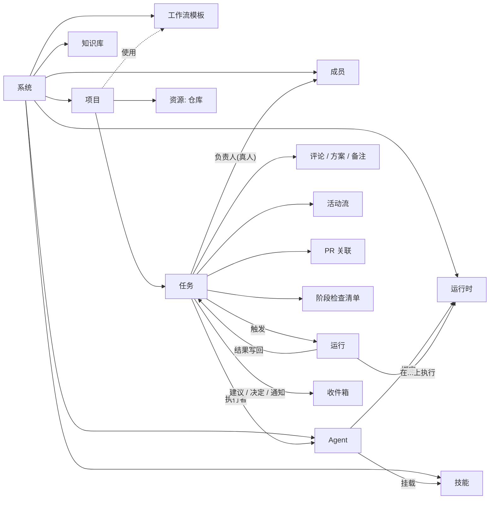
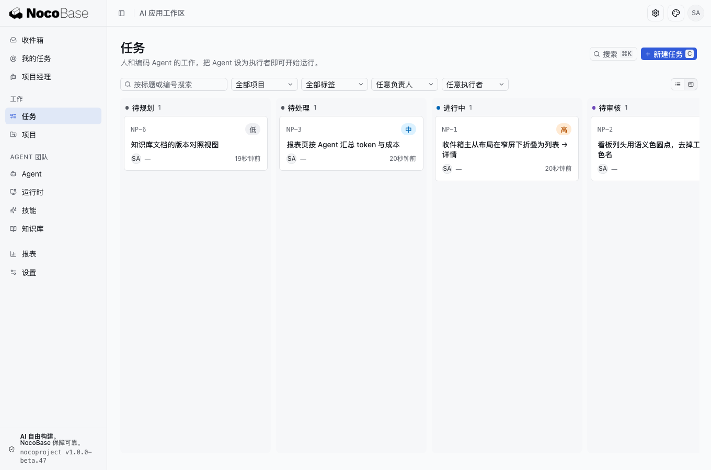
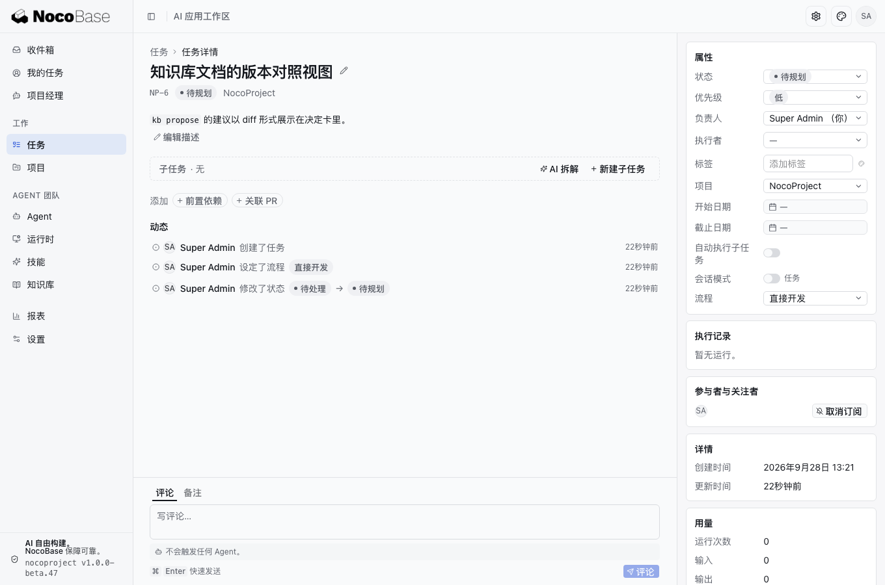
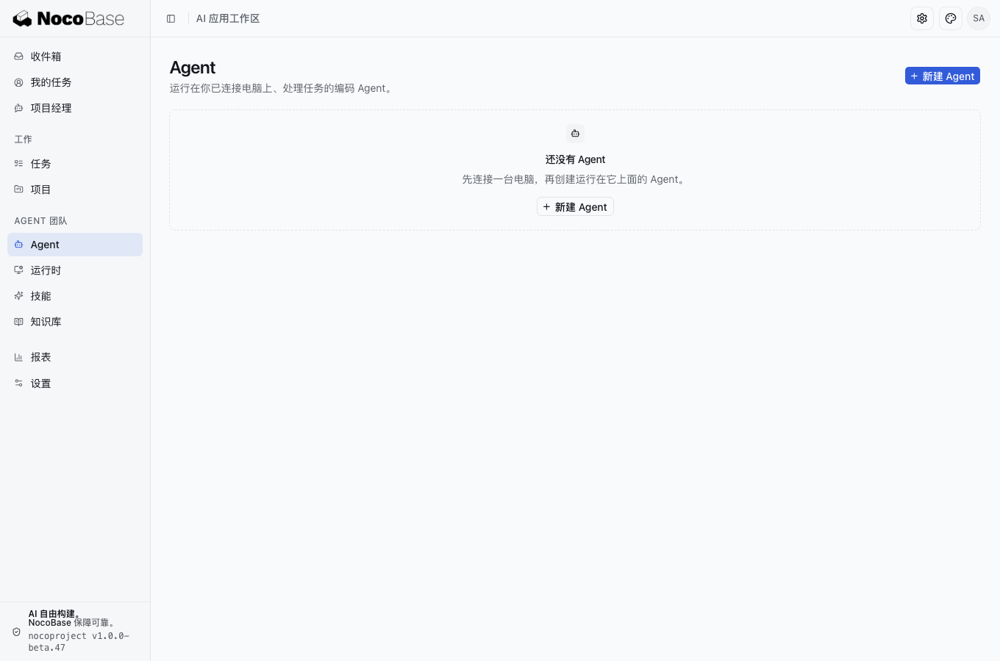
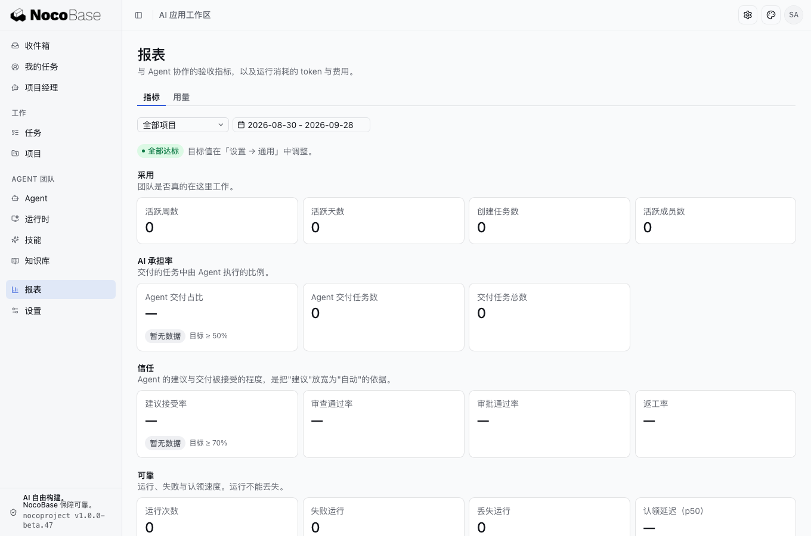
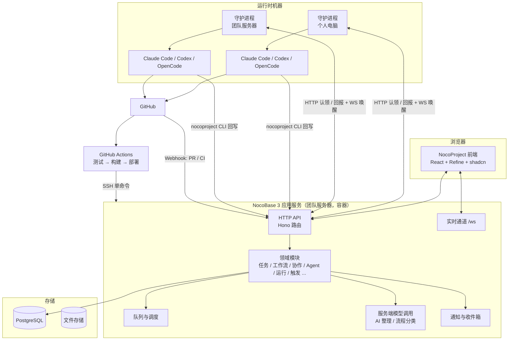

# NocoProject 产品与技术方案

> 版本：v0.10，2026-09-28
> 依据：《NocoSolution 总纲》v0.6（子模块 `nocosolution/`）、《Multica 调研》、Multica 仓库（v0.5.x，只读，不复用代码）、NocoBase 3 应用模板与底座技能文档、应用仓库 `nocoproject/docs/`（阶段契约、协议与集成记录）
> 阅读建议：第 0–3 章讲产品是什么、怎么用，不需要技术背景；第 4–5 章是技术层，供研发评审；第 6 章是已交付能力与路线图；第 7–9 章是决策、临时实现与对总纲的汇报；附录 C 是按时间排列的阶段记录。
> 同步规则：本文档是唯一来源，网页版由 `scripts/build-doc.mjs` 从本文件生成，每次修改后重新生成并发布。

### 修订记录

| 版本 | 日期 | 变化 |
|---|---|---|
| v0.1 | 2026-09-27 | 首版讨论稿 |
| v0.2 | 2026-09-27 | 落实九项决策：全栈 TypeScript、首批工具增加 OpenCode、多工作区分阶段、去掉独立聊天、Agent 自派子任务改为任务属性、服务器运行时默认容器、开源许可、CLI 命名；新增第 8 章"临时实现清单"，标记工作流审批、活动流与变更事件两项为临时实现，待替换为 NocoBase 官方能力 |
| v0.3 | 2026-09-27 | 去掉工作区概念，一套系统管理多个项目，隔离靠项目；新增 2.6 节详细说明 Agent 拆解子任务后的依赖、并行与协调机制；Agent 之间的派活从"禁止"改为"受限委派"：默认需负责人确认，可按 Agent 配置直接委派名单，也可由工作流阶段动作预设 |
| v0.4 | 2026-09-27 | Phase 0 技术验证完成：三个风险全部跑通；认领协议补充按运行时的事务级咨询锁；记录 OpenCode 的两个真实坑 |
| v0.5 | 2026-09-27 | Phase 1 迭代 1（协作骨架）交付并联调通过 |
| v0.6 | 2026-09-27 | Phase 1 迭代 2（交付链路）交付并联调通过 |
| v0.7 | 2026-09-27 | Phase 1 迭代 3（打磨与自用前置）交付，知识库 v0 提前到 Phase 1，真实 DeepSeek 与 GitHub 接入 |
| v0.8 | 2026-09-28 | 进入 dogfooding；迭代 4：设计先行流程、项目经理 Agent、统一新建任务，两份前端标准 |
| v0.9 | 2026-09-28 | 面向外部读者重写：0 章改为不依赖参考产品的总览（传统 / AI-native 一代 / NocoProject 对比、与其他 Solution 的关系、当前状态）；3 章按现在的界面重写；6 章拆成"已交付能力一览"与"路线图"，迭代记录移到附录 C；Multica 对照收进附录 B。内容更新：工作流阶段动作服务端交付（进入条件、进入效果、定义校验、审批作废、防循环）记入 2.4、2.5、4.6 与 6.1；内置状态 9 个；正式环境迁到团队服务器并由 CI 自动部署、CLI 安装包随应用发布（4.12）。按总纲附录 C 补齐：八条原则映射（1.3）、自治矩阵（2.7）、AI 产出形态映射（2.8）、与其他 Solution 的联动（2.9）、Agent 工具表（4.5）、六类验收指标（6.3）、需要拍板的事项（7.2）；新增第 9 章"对总纲的汇报"。依据改为引用总纲 v0.6 |
| v0.10 | 2026-09-28 | 工作流模板修改改为"Agent 提议、人决定"，不做界面编辑器（NP-77）：2.4 增加模板修改规则（提议、校验、修订快照、系统模板只读）；阶段动作第二、三步交付（模板提议 / 修订 / 管理员写接口、CLI `workflow` 与 `issue checklist`、收件箱模板提议卡、模板页进入动作与修订历史、任务页检查清单）记入 0、2.2、6.1；6.2 与 7.2 去掉模板编辑器 |

---

## 0. 一页总览

**NocoProject 是什么**：一个"人与 Agent 协同"的项目管理系统，基于 NocoBase 3 构建，开源。人定方向、拍板、验收；Agent 在开发者的电脑或团队服务器上运行 Claude Code、Codex、OpenCode 等编码工具，把任务真正做出来；讨论、方案、运行记录、代码变更（PR）、状态变化全部沉淀在同一条任务上。第一阶段服务软件开发团队。

**它解决什么问题**：编码 Agent 已经能独立完成一个任务，但团队层面缺三样东西：一是**责任**，Agent 做的事最终谁负责、谁验收；二是**秩序**，一件事处在哪个阶段、谁能推进、下一步是什么，不能靠提示词祈祷；三是**留痕**，Agent 的每一次运行、每一条交付、每一次拍板都要可追溯。NocoProject 把这三样做成服务端强制的规则，而不是约定。

**三代项目管理工具的对比**

| 维度 | 传统项目管理（Jira、Linear 一类） | AI-native 一代（Multica 等） | NocoProject |
|---|---|---|---|
| 谁干活 | 人 | 人和 Agent 都可以被分配任务 | 人是负责人，Agent 是执行者，两个字段分开 |
| 责任归属 | 负责人是人 | 负责人可以是 Agent 或小队 | 每条任务必须有一个真人负责人；`done` 只有人能写 |
| 谁能唤醒 Agent | 不适用 | 人、Agent、自动化都可以，Agent 之间可以互相 @ | 只有人和人配置的规则；Agent 之间是受限委派，每一跳都有人的决定 |
| 阶段 | 状态自由流转 | 状态自由流转，靠提示词约束 Agent | 项目级工作流定义阶段、谁能推进、进入时做什么，服务端强制 |
| 执行环境 | 无 | 个人电脑 | 个人电脑 + 团队服务器 |
| 拿到的东西 | SaaS | SaaS 或自托管 | 源码归用户，可由 Coding Agent 持续定制 |

**当前状态（2026-09-28）**：技术验证与内部可用 MVP 的四轮迭代已交付，产品已部署在团队服务器上，NocoProject 自己的开发就在 NocoProject 里进行（dogfooding）。工作流阶段动作（Phase 2 第一项）已交付：服务端进入条件与进入效果、由 Agent 提议并经人确认的模板修改、CLI 与界面。已交付能力一览见 6.1 节，路线图见 6.2 节。

**与其他 NocoBase Solution 的关系**：NocoProject 是 NocoSolution 系列的一员，与 NocoSupport（客户服务）、NocoCRM（客户与销售）共用同一套"人与 Agent 协同"的骨架：真人负责人、触发规则、收件箱两栏、阶段模板服务端强制、AI 产出五种形态。系列里凡是"要改代码"的工作都通过 NocoProject 承接，其他 Solution 不自建 Coding Agent 运行时；NocoProject 的运行时与调度层因此从第一天就与任务领域解耦，后续抽成共享包（2.9 节）。

**技术基调**：服务端、前端、守护进程与 CLI 全部 TypeScript；复用 NocoBase 3 底座的认证、权限、通知、队列、调度、服务端 AI、文件、实时通道；自建任务领域模型、调度协议、守护进程与编码工具适配器。按领域拆模块，硬约束在服务端。工作流审批、活动流与变更事件两项 NocoBase 正在开发，NocoProject 先做临时实现并隔离在接口后面，官方能力发布后替换（第 8 章）。

**开源**：Apache 2.0 加自定义附加条款（禁止未授权托管转售与去品牌）。

**节奏**：技术验证 → 内部可用 MVP（四轮迭代）→ 对外发布 1.0 → 增强。前两段已完成，目前处于 dogfooding 与 1.0 准备期。

---

## 1. 定位与原则

### 1.1 一句话定位

让一个几个人的开发团队，带着一队 Agent，做出二十个人的推进速度，而每一件事都有人负责、有据可查。

Let a small development team, working with a squad of agents, move at the pace of twenty, with every piece of work owned by a person and traceable.

### 1.2 目标用户与场景

- 首发对象：使用 NocoBase 的软件团队（包括我们自己），5 到 50 人，已经在用 Claude Code、Codex、OpenCode 等编码工具。
- 典型场景：
  - 产品经理把一段需求描述或会议纪要交给"AI 整理"，得到一批任务草稿，确认后创建；
  - 开发者作为负责人把任务交给 Agent 执行，在任务的评论里指导；Agent 提交 PR，人评审合并，任务自动完成；
  - 需要先想清楚的任务走"先出方案"：Agent 先写方案，负责人批准后才开始改代码；
  - 任何成员随时问"项目经理"Agent：哪些任务卡住了、这周做了什么、某个模块的约定是什么；
  - 团队服务器上的 Agent 承接迁移、巡检、依赖升级等不适合占用个人电脑的工作。
- 后续扩展：NocoSupport、NocoCRM 等 Solution 里"要改代码"的工作交给 NocoProject；Agent 执行运行时抽成共享包。

### 1.3 六条产品原则

每条原则都有服务端强制机制，不是提示词约束。右列是到《NocoSolution 总纲》八条原则的映射。

| # | 原则 | 强制机制 | 对应总纲 |
|---|---|---|---|
| 1 | **人负责，Agent 执行。** 任务的负责人永远是真人；Agent 的交付要人验收；`done` 只能由人写入 | 负责人字段必填且只能是成员；Agent 写终态被拒；交付进负责人"待我决定" | 1 人负责，Agent 执行 |
| 2 | **人是唯一的触发源。** Agent 开始工作一定能追溯到某个人的动作或某个人配置的规则；Agent 想让另一个 Agent 干活，必须经过人的确认或人预先配置的授权 | 只有 `trigger` 模块能创建运行；Agent 的 @ 不触发；Agent 指定其他 Agent 变成"执行者建议" | 2 人是唯一的触发源 |
| 3 | **阶段是明确的。** 任务处在哪一步、谁该推进、下一步是什么，由项目工作流定义 | 转换矩阵服务端校验；Agent 只看到被允许的转换；进入条件与进入效果由服务端执行 | 3 阶段是明确的 |
| 4 | **一切在任务上留痕。** 描述、讨论、方案、每一次运行、PR、状态变化都挂在同一条任务上 | 所有写操作发领域事件，活动流是事件的投影；聊天不是记录 | 4 一切在对象上留痕；6 数据有来源 |
| 5 | **代码不出门。** 平台只存任务、配置、运行记录；代码、工具凭据留在运行时所在的机器上 | 服务端没有仓库内容；凭据加密存储、执行时下发并在事件流脱敏 | 7 数据与凭据留在边界内 |
| 6 | **可靠优先于花哨。** 每一个自动行为都有明确的失败语义、重试规则和可见的原因码 | 两套原因码；只重试瞬时故障；失败退回负责人；阶段动作有防循环限额 | 8 可靠优先于花哨；5 边界动作有放行规则 |

### 1.4 明确不做的（第一版）

- 小队（Squad）和 Agent 之间不经人授权的相互委派。
- 多工作区。一套系统只有一个组织，靠项目做隔离。
- 不依附任务的自由聊天（"项目经理"对话和任务上的会话模式覆盖这个需求）。
- 桌面端与移动端（Web 优先，守护进程用 CLI 安装）。
- 插件市场、第三方 iframe 插件。
- 云托管计费。

---

## 2. 核心对象模型

### 2.1 对象图



### 2.2 对象定义

左列对应总纲 4.1 节的骨架对象；"现状"以 2026-09-28 为准。

| 对象 | 定义 | 现状 |
|---|---|---|
| 系统 System | 一套部署就是一个组织；成员、项目、Agent、运行时、技能、知识库、工作流模板都是系统级资源 | 已实现；没有工作区 |
| 成员 Member | 系统里的真人，角色 owner / admin / member | 已实现；首个用户成为 owner；viewer 留到第二阶段 |
| 项目 Project（组织单元） | 一组任务 + 描述（注入 Agent 上下文）+ 仓库资源 + 工作流模板 + 项目成员与可见性 + 项目负责人 | 已实现；私有项目对非成员不可见（服务端强制） |
| 任务 Issue（核心对象） | 工作的基本单位：标题、描述、状态、优先级、负责人、执行者、流程（直接开发 / 先出方案）、父子、阶段批次、依赖、标签、日期、执行模式 | 已实现 |
| 负责人 Owner | 任务上必填的真人，验收、拍板、写 `done` | 已实现 |
| 执行者 Executor | 在任务上干活的 Agent 或成员；设为 Agent 时平台创建运行 | 已实现 |
| 工作流模板 Workflow（阶段模板） | 状态序列 + 生命周期分类 + 转换矩阵 + 阶段动作 + 审批门禁；系统级定义，项目选用 | 定义、校验、转换矩阵、审批门禁、阶段动作已实现；两个种子模板（系统模板，只能复制）；模板修改由 Agent 提议、owner / admin 在收件箱确认，不做界面编辑器 |
| 活动流 Activity（时间线） | 任务上所有变化：评论、属性变更、运行、PR 事件、审批、阶段动作混排 | 已实现。**临时实现**：底层变更事件与活动记录自建（第 8 章） |
| Agent（业务 Agent） | 一份可复用的身份配置：名称、指令、技能、模型与推理强度、运行时、访问范围、并发上限、环境变量、委派名单、类型（编码 / 项目经理） | 已实现；公共 Agent 的资源限制待做 |
| 技能 Skill | `SKILL.md` + 附件的工作方法包，挂给多个 Agent | 已实现 |
| 运行时 Runtime | 一台接入的机器上的一款编码工具 | 个人运行时已实现；服务器运行时目前是"装在服务器上的普通运行时"，令牌、配额、容器隔离待做 |
| 运行 Run | Agent 的一次执行：触发原因、状态、`actorUserId`、`ownerUserId`、会话、工作目录、分支、消息流、用量、失败原因 | 已实现 |
| 触发 Trigger | 把"发生了什么"翻译成"要不要创建运行"的唯一入口，有一份规则表（2.5 节） | 已实现 |
| 收件箱 Inbox | 给人的通知中心，分"待我决定"和"通知" | 已实现；决定卡直接可操作 |
| 建议 Suggestion | Agent 或工作流提出但未生效的变化：执行者建议、拆解方案、知识库更新建议 | 已实现 |
| 决定 / 审批 Decision | 必须人拍板的事：交付验收、方案审批、执行者建议、审批门禁、PR 待合并、知识建议 | 已实现。**临时实现**：审批请求与审批人解析自建（第 8 章） |
| 阶段检查清单 Checklist | 进入某状态时按模板生成的清单快照，必填项未勾完不能离开该状态 | 已实现：服务端强制、Agent 接口与 CLI `issue checklist`、任务页清单卡 |
| 知识库 Knowledge | 系统级或项目级 Markdown 文档，带版本；供人读、供 Agent 按需读；Agent 只能建议更新 | v0 已实现 |
| 报表 Report | 六类 AI 效果指标（6.3 节）+ 用量与成本 | 已实现 |
| 自动化 Automation | 定时或 Webhook 触发的规则 | 待做（Phase 2） |
| 信号 Signal | 总纲的可选骨架 | 未建；Phase 2 评估是否把自动化与 Webhook 统一到信号上 |

### 2.3 负责人与执行者（核心规则）

任务上有两个字段：

- **负责人 owner**：必填，只能是系统成员（真人）。默认为创建者。负责人对任务结果负责：验收、拍板、把状态改为 `done`。
- **执行者 executor**：可空，可以是 Agent 或成员。设为 Agent 时，平台为该 Agent 创建运行；设为成员时只是记录归属，不创建运行。

规则：

1. 创建任务时负责人不能为空；由 Agent 创建的任务，负责人继承父任务负责人，父任务不存在时继承触发它的那个人。Agent 不能改负责人。
2. 更换负责人会通知新旧负责人，原负责人保留订阅。
3. 更换执行者为另一个 Agent 时，会为新执行者创建运行，旧执行者已经开始的运行不会被自动停止（界面给出提示与"停止旧运行"按钮）。
4. Agent 把执行者设为**自己**（拆出的子任务）：受任务属性"允许执行者自行承接子任务"控制（2.6 节）。
5. Agent 把执行者设为**另一个 Agent**：不直接生效，而是生成一条"执行者建议"，进入负责人收件箱"待我决定"，负责人确认后才创建运行。两种情况免确认：该 Agent 的"可直接委派给"名单里包含目标 Agent（由 Agent 所有者或管理员配置），或目标 Agent 是工作流阶段动作预设的。服务端强制。
6. 项目经理类型的 Agent（`kind = manager`）不能被设为普通任务的执行者，它只承接对话与总结运行（2.7 节）。
7. 看板卡片同时显示负责人头像和执行者头像，执行者是 Agent 时显示"工作中"状态。

### 2.4 状态与工作流

**生命周期分类**（固定 4 个，Agent 简报、自动行为和报表只依赖它）：`unstarted`、`started`、`done`、`closed`。

**内置状态**（固定 9 个，每个模板都必须包含，分类不可改）：

| 状态 | 分类 | 说明 |
|---|---|---|
| `backlog` | unstarted | 未排期 |
| `todo` | unstarted | 待开始；执行者是 Agent 时移出 `backlog` 即入队 |
| `analysis` | started | 分析中：先出方案的任务在这里做需求分析 |
| `proposal_review` | started | 方案待审：Agent 已提交方案，等负责人批准 |
| `in_progress` | started | 进行中 |
| `in_review` | started | 待验收：Agent 已交付 |
| `blocked` | started | 阻塞 |
| `done` | done | 完成，只有人能写 |
| `cancelled` | closed | 取消，只有人能写 |

**工作流模板**：系统级定义，项目选用。一个模板包含：

- 状态序列：9 个内置状态 + 自定义状态（每个自定义状态归入一个分类，创建后分类不可改；最多 40 个状态）。
- 转换矩阵：从哪个状态可以到哪个状态，每条转换标明谁可以执行（人 / Agent / 系统）。Agent 不能写 `done` / `closed` 分类的状态；每个状态都必须有人能走的出边。
- 阶段动作：进入某状态时自动做什么，分**进入条件**与**进入效果**两类（下表）。
- 审批门禁：某条转换可以要求审批（审批人是负责人、项目负责人或管理员）。请求转换时生成一条审批请求进入审批人的收件箱"待我决定"，通过后转换才生效，驳回则原状态不变并留言。**临时实现**（第 8 章）。
- 模板定义在保存前由服务端整体校验，任何一处不合法都返回全部问题的清单。
- **模板修改：Agent 提议、人决定**，不做界面编辑器。人在任务里描述想要的流程，Agent 用 `nocoproject workflow get` 读模板、写出整份新定义、用 `nocoproject workflow propose` 提交（改现有模板或复制出新模板）；提交时当场校验并检查删除的状态上是否还有任务。系统 owner / admin 在收件箱看到差异摘要（进入阶段会自动唤醒的 Agent 单独提示）后接受或驳回；接受时模板已被改过则提议作废，需基于最新版重提。每次生效写修订快照，立即对所有使用该模板的项目起作用。两个种子模板是系统模板，只能复制。Agent 不能绕过提议直接写：模板决定 Agent 能走哪些转换、哪些要审批、进入哪个阶段唤醒哪个 Agent，直接写等于 Agent 改自己的权限边界。管理员另有一个无界面的直接写接口作兜底。

**阶段动作**（服务端已交付；每个状态最多 10 个动作）：

| 动作 | 类别 | 行为 |
|---|---|---|
| 要求关联 PR 已合并 `requirePrMerged` | 进入条件 | 关联的已合并 PR 数不足时拒绝进入，任务不变 |
| 检查清单 `checklist` | 进入效果 + 离开条件 | 进入时按模板生成清单快照（重新进入保留已勾项）；离开时必填项未勾完则拒绝，取消除外 |
| 通知负责人 `notifyOwner` | 进入效果 | 负责人收件箱收到一条通知（负责人自己改的不通知） |
| 为执行者创建运行 `runExecutor` | 进入效果 | 以负责人名义为当前执行者入队一次运行，可带指令模板（变量：任务编号、标题、来源与目标状态、负责人）；可预设另一个 Agent：负责人有权调用它就直接换执行者，否则降级为建议 |
| 默认执行者建议 `suggestExecutor` | 进入效果 | 生成一条来源为"工作流"的执行者建议，负责人一键采纳；离开该状态时未决定的建议自动作废 |

转换的执行顺序固定：`Agent 可写转换检查 → 设计门（先出方案的任务）→ 进入条件 → 审批门禁 → 写入 → 进入效果`。进入条件在事务内检查，不通过则什么都不改；每个进入效果单独包在保存点里，一个效果失败只回滚它自己并记录，转换照常生效。审批通过后再应用转换时会重新检查进入条件，不再满足的审批作废并通知审批人与请求人。防循环：同一任务同一状态在设定窗口内（默认 24 小时）由阶段动作创建的运行超过上限（默认 3 次）即停止并通知负责人。Agent 自己把任务推进到会唤醒自己的状态时不触发运行。

**默认模板"软件开发"**（另有一个"软件开发（验收审批）"模板，`in_review → done` 要求审批）：

```
backlog → todo → in_progress → in_review → done
            ↘ analysis → proposal_review ↗（先出方案的任务）
                     ↕ blocked
任意非终态 → cancelled（仅人）
```

Agent 可写的转换：`todo → analysis`（先出方案）、`analysis → proposal_review`、`todo / blocked → in_progress`、`in_progress → in_review`、`in_progress / analysis / proposal_review → blocked`。`done` 和 `cancelled` 只有人能写。

**设计先行流程**：任务有"流程"属性，`direct`（直接开发）或 `design_first`（先出方案），新建时可选，默认由服务端分类器判定（启发式优先：描述长、含"设计 / 方案 / 架构 / 重构 / 迁移"等词、有子任务意图的判为先出方案；只有中等长度且无规则命中的才问一次模型）。先出方案的任务：Agent 在 `analysis` 做分析并提交一条"方案"评论（需求理解 / 方案 / 影响范围 / 风险 / 验证计划），状态进入 `proposal_review`，负责人收到决定卡"批准进入开发 / 打回修改"；批准前服务端拒绝 Agent 进入 `in_progress`，简报也禁止改代码与提 PR。人可以跳过设计直接推进，记一条活动。

**系统自动转换**（三条）：
- 运行失败且没有其他活动运行和待重试时，`in_progress` 回到 `todo`。
- 关联 PR 全部合并后，任务改为设置里指定的状态（默认 `done`，可设为"不改变"）。
- 自动化按规则创建任务时写入初始状态（自动化待做）。

**子任务与阶段批次**：子任务可以声明"被谁阻塞"，也可以用批次号分批。同一批次的子任务全部到终态时通知父任务负责人；父任务执行者是 Agent 时创建一次协调运行。这是系统触发，不是 Agent 触发 Agent（2.6 节）。

### 2.5 谁能唤醒 Agent（触发规则表）

| 触发动作 | 发起者 | 是否创建运行 | 备注 |
|---|---|---|---|
| 把执行者设为 Agent | 人 | 是（任务不在 `backlog` 时） | 弹确认窗，可选"暂不开始" |
| 任务从 `backlog` 移出 | 人 | 是（执行者是 Agent 时） | 同上 |
| 评论中 @Agent | 人 | 是 | 一条评论 @ 多个 Agent 各得一次运行 |
| 回复 Agent 的评论 | 人 | 是，路由给该 Agent | 不改变执行者 |
| 无 @ 的顶层评论 | 人 | 路由给当前执行者 Agent | 内部备注 `/note` 不触发 |
| 批准方案 / 打回修改 | 人 | 是 | 批准后的运行以"方案已批准，按方案实现"开场 |
| 验收时打回 | 人 | 是 | 状态回 `in_progress`，Agent 再次交付 |
| 工作流阶段动作 `runExecutor` | 系统（人配置） | 是，以负责人名义 | 有防循环限额；Agent 自己进入该状态时不触发 |
| 子任务批次完成 | 系统 | 是（父任务执行者是 Agent 时） | 唤醒父任务执行者做协调 |
| 子任务的前置依赖全部完成 | 系统 | 是（子任务执行者已定时） | 被阻塞的子任务自动放行 |
| 任务完成后的总结 | 系统（设置开启时） | 是，给项目经理 Agent | 写一条内部备注并建议知识库更新，不通知任何人 |
| 与项目经理对话 | 人 | 是 | 每个成员一条会话式对话任务 |
| 自动化（定时 / Webhook） | 系统（人配置） | 是 | 待做 |
| 运行失败自动重试 | 系统 | 是 | 只对瞬时故障 |
| Agent 创建子任务并指定自己为执行者 | Agent | 是，当父任务开启"允许自行承接子任务" | 否则子任务执行者为空，等负责人分派 |
| Agent 创建子任务并指定另一个 Agent 为执行者 | Agent | **默认否**：变成"执行者建议"，负责人确认后才运行 | 目标在该 Agent 的"可直接委派给"名单内时直接生效 |
| 负责人确认执行者建议 | 人 | 是 | 收件箱"待我决定"，可批量确认 |
| 工作流阶段动作 `suggestExecutor` | 系统（人配置） | **否**：生成建议，负责人采纳后才运行 | 离开该状态时未决定的建议作废 |
| Agent 评论中 @ 另一个 Agent | Agent | **否** | 渲染为普通文本，不触发；委派只走结构化的执行者通道 |
| Agent 使用 AI 插件的子 Agent 派发工具 | Agent | **否** | 编码 Agent 不经过 AI 员工插件；服务端 AI 只做解析与分类 |

每次运行记录两个人：`actorUserId`（这次运行承载谁的授权：触发的那个人、确认建议的人，或名单与规则的配置者）和 `ownerUserId`（任务负责人，用于统计与追责）。每一次委派都能指到一个人的决定，归因永远只有一跳。

### 2.6 Agent 拆解子任务：依赖、并行与协调

用一个例子说清楚。Engineer 这个 Agent 负责"实现客户管理模块"，它拆出五条子任务：搭骨架、登录、客户列表、联系人、商机。

**每条子任务都是独立的任务。** 各自有负责人（继承父任务的真人负责人）、执行者、状态、运行记录、工作目录和分支。子任务不是父任务运行里的一段循环，而是看板上看得见、能单独讨论和验收的对象。

**同一个 Agent 可以并行跑多条子任务。** 每条子任务的运行是一次独立的进程和独立的会话，在自己的 worktree 里工作。并行数受两个上限约束：这个 Agent 的并发上限和所在机器的槽位。

**依赖由系统管，不靠 Agent 自觉。** 子任务可以声明"被谁阻塞"（`blockedBy`），也可以用批次号（`stage`）分批：
- 有未完成前置的子任务停在 `todo`，系统不为它入队，看板上显示"等待 N 项前置"。
- 前置全部到终态（`done` 或 `cancelled`）时，系统自动为它创建运行（执行者已定时），或通知负责人分派（执行者为空时）。
- 批次号是依赖的简写：第 2 批默认被第 1 批的全部子任务阻塞。
- 依赖关系是数据，Agent 通过 CLI 写入，人可以在界面上改；新增阻塞依赖会撤回已排队的运行。

**协调由父任务的执行者负责。** 每当一批子任务完成，系统唤醒父任务的 Agent 一次。它在这一轮里读子任务的结果和评论，调整剩余子任务的优先级、依赖或拆法，补建或取消子任务，决定是否进入下一批，全部完成后把父任务推到 `in_review` 并写总结。它能改自己拆出来的子任务，不能改别人的任务。人在任何时候都可以介入。

**"允许执行者自行承接子任务"开关**（任务属性 `autoExecuteSubtasks`）只决定一件事：
- 开：Agent 拆出的子任务默认以它自己为执行者，依赖满足即开跑。适合边界清楚、风险可控的工作。
- 关：Agent 只把拆解方案摆出来（子任务执行者为空），负责人收件箱收到"拆解待确认"，看过后一键"全部由该 Agent 执行"或逐条分派。适合大改动或第一次合作的 Agent。
- 子任务继承父任务的值；系统设置里定默认值（默认关）；"确认开始"弹窗里可以当场改。

**把子任务交给别的 Agent。** 三条路径，每条都有人在链条上：
1. 默认路径：Engineer 创建子任务并指定 Translator 为执行者，系统生成"执行者建议"进负责人收件箱，负责人确认后才创建运行。
2. 预授权路径：Engineer 的所有者或管理员配"可直接委派给：Translator、Reviewer"，之后 Engineer 派给这两个 Agent 无需逐次确认。一次性授权，记入审计。
3. 规则路径：工作流阶段动作预设"进入某阶段由 Translator 执行"，系统按规则派，Agent 不需要指定。

**代码怎么合到一起。** 多条子任务并行改同一个仓库，各自在分支 `agent/<agent>/<任务编号>` 上工作，按依赖顺序各自提 PR，后面的子任务在前面的 PR 合并后才放行。集成分支模式（父任务持有分支、子任务 PR 合到它、最后由父任务提一个 PR 到主干）在路线图上。

**不做的**：子任务之间不能互相 @ 或互相唤醒；子任务的 Agent 遇到跨子任务的问题，写在父任务的评论里，由父任务协调轮处理。

### 2.7 Agent 的分工与自治矩阵

**两类 Agent**：

| 类型 | 做什么 | 跑在哪 | 不能做什么 |
|---|---|---|---|
| 编码 Agent（`kind = coder`） | 承接任务：分析、写方案、改代码、提 PR、拆子任务、评论回写 | 个人电脑或团队服务器上的编码工具 | 改负责人、写终态、越过工作流写状态、绕过委派规则指定其他 Agent |
| 项目经理 Agent（`kind = manager`） | 回答成员的提问（跨项目，只读）、任务完成后写总结备注、建议知识库更新 | 任一运行时（目前是 OpenCode + DeepSeek） | 做普通任务的执行者；它读到的一切都按提问者的可见范围过滤 |

**自治矩阵**（动作 × 策略，四档：自动 / 建议 / 审批 / 人）。系统设置与工作流模板决定每一格，服务端在接口里强制：

| 动作 | 自动 | 建议 | 审批 | 人 |
|---|---|---|---|---|
| 读任务、评论、知识库、项目上下文 | ✓ | | | |
| 写评论、内部备注、附件 | ✓ | | | |
| 写"事实"状态（进行中、待验收、阻塞、方案待审） | ✓（转换矩阵允许时） | | ✓（模板要求审批的转换） | |
| 进入开发（先出方案的任务） | | | ✓ 负责人批准方案 | |
| 建子任务并指定自己 | ✓（`autoExecuteSubtasks` 开） | ✓（关：拆解待确认） | | |
| 指定另一个 Agent 为执行者 | ✓（命中委派名单或阶段动作预设） | ✓（默认：执行者建议） | | |
| 更新知识库 | | ✓（`kb propose`，项目负责人接受） | | |
| 写 `done` / `cancelled`、改负责人 | | | | ✓ |
| 合并 PR、部署 | | | | ✓（Agent 只到开 PR 为止） |

"建议"与"审批"是两种机制：建议不中断运行，Agent 把值写成建议、本轮正常结束；审批门禁在人的决定之前不写入状态。放宽路径：新 Agent、新项目先全部走"建议"，看报表里的接受率（阈值 ≥ 70%）再逐项切成"自动"（配委派名单、开自行承接、在模板里预设执行者）。

### 2.8 AI 产出的五种形态

按总纲第 5 章的五种形态，NocoProject 里 AI 的每一种产出都对应其中一种：

| 产出 | 形态 | 呈现 | 人做什么 |
|---|---|---|---|
| Agent 的评论、方案、运行记录、PR 关联、状态"事实" | 直接生效 | 写进任务时间线，带运行来源 | 无；验收时整体评价 |
| AI 整理出的任务草稿（新建任务、批量录入） | 预填表单 | 可编辑的草稿表，逐行校验标红 | 改两处，点"创建"；AI 从不替人创建 |
| 执行者建议、拆解方案、工作流的默认执行者建议、知识库更新建议 | 建议卡 | 任务页与收件箱，接受 / 忽略，同类可全部接受 | 一键 |
| 交付验收、方案审批、审批门禁、PR 待合并 | 决定卡 | 收件箱"待我决定" + 任务页"等你决定"，决定内容完整展示，动作就在下面 | 一键选一个；处理完自动归档 |
| 项目经理的回答与任务总结备注 | 准备材料 | 对话面板；总结是任务上的内部备注 | 用、改或忽略 |

规则：AI 不提交、不发送、不删除、不合并；每个产出显示依据（运行、评论、PR）；不确定就留空；决定卡与建议卡的处理成本必须低于"自己去改"。

### 2.9 与其他 Solution 的联动

| 方向 | 接口 | 退化方案 |
|---|---|---|
| NocoSupport / NocoCRM 里"要改代码"的事 → NocoProject 任务 | 总纲第 12 章的 `WorkLink`：对方创建任务并持有关联，NocoProject 的状态变化回传 | 没有 NocoProject 时对方只记一条待办 |
| NocoProject 的运行时与调度层 → 共享包 | `runtime` + `run` + 守护进程不依赖 `issue`，两个服务端 Solution 都进入 Phase 1 后抽成包 | 抽包前各 Solution 不自建 Coding Agent 运行时 |

NocoProject 独立可运行，不依赖任何其他 Solution。

---

## 3. 界面与用户旅程

### 3.1 信息架构（侧边栏）

```
收件箱             待我决定 / 通知
我的任务           我负责的 / 我执行的
项目经理           一条会话式对话
──────────  工作
任务               看板 / 列表；新建任务（AI 整理 / 手动）；⌘K 搜索
项目               列表与详情（看板、资源、成员、知识库文档）
──────────  Agent 团队
Agent
运行时             添加电脑
技能
知识库
──────────
报表               指标 / 用量
设置               通用、成员、工作流、标签、GitHub
```

左侧导航、中间主内容、详情页右侧属性栏；键盘快捷键：C 新建任务、⌘K 搜索、⌘Enter 发送、收件箱 J / K / E。中英文界面、深浅主题、compact 与 default 两套密度预设都正常显示。

### 3.2 关键页面

**任务看板 / 列表**
- 看板按状态分列，列顺序来自项目工作流模板；"分析中"与"方案待审"两列只在有先出方案的任务时出现。卡片显示编号、标题、负责人、执行者、"工作中"指示、流程徽标。
- 拖拽换列即改状态，若转换不被工作流允许，卡片弹回并提示原因；若目标状态会触发运行，弹确认窗。
- 列表是可排序表格，游标分页；看板与列表的选择按页记住。



**新建任务（一个对话框两个标签）**
- **AI 整理**（默认）：一个文本框（描述需求，或粘贴需求清单、会议纪要）+ 项目选择 → "整理" → 草稿表（标题、优先级、标签、阶段、父子、执行者、流程）→ 确认创建，一条或多条。解析由服务端模型完成，模型不可用时走启发式规则。
- **手动**：标题、描述、负责人、执行者、优先级、项目、流程、执行模式。

**任务详情（三栏）**
- 主栏：面包屑、标题与元信息行（编号、状态、项目、正在进行的运行）、描述（富文本，存 Markdown）、子任务（含批次与依赖）、PR 卡片（状态、增删行、CI、可合并性、自动完成开关）、"等你决定"区块（交付内容、方案正文、建议列表，动作就在下面）、时间线（评论 / 变更 / 运行 / 审批 / 阶段动作混排，线程可折叠、可解决、可加表情）、底部评论框（@ 候选、`/note` 内部备注、⌘Enter 发送）。
- 右栏：属性（状态、流程、负责人、执行者、优先级、日期、项目、标签）、执行记录（进行中置顶，可看日志、停止、重试、失败原因）、用量、执行模式（任务 / 会话）、订阅者。
- 空的区块不占位。



**收件箱**
- 主从布局：左侧分组列表（决定在前），右侧是选中项的完整上下文和固定的动作条。
- "待我决定"承接：交付待验收、方案待审、Agent 报阻塞、执行者建议、拆解待确认、审批请求、PR 待合并、知识库更新建议。"通知"承接评论、状态变化、@、分派变化、进入某阶段、阶段动作问题。
- 同一任务的通知合并；同一父任务下的多条执行者建议合并成一张卡，可批量确认；处理完自动归档。

**项目经理**
- 一整页的对话面板：随时提问，答案按提问者的可见范围给出，引用任务编号。任务完成后的总结备注出现在该任务的时间线上，带"总结"标签。

**项目页**
- 看板 + 详情标签页：状态、负责人、日期、进度、描述（注入 Agent 上下文）、仓库资源（地址与默认分支）、工作流模板、项目成员与可见性、知识库文档。

**Agent 页**
- 列表：名称、类型、工具、运行时、在线 / 离线、负载、访问范围。
- 详情：指令、类型（编码 / 项目经理）、技能、模型与推理强度、运行时、访问范围（仅自己 / 指定成员 / 所有成员）、可直接委派给（其他 Agent 名单，仅所有者与管理员可改，留审计）、并发上限、环境变量（服务端加密存储，owner / admin 解锁查看，留审计）。



**运行时页**
- 已接入的机器：在线状态、心跳、检测到的编码工具与版本、当前运行。
- "添加电脑"：按当前访问的服务器地址生成两条命令（从服务器安装 CLI、登录并启动守护进程）。

**技能页、知识库页**
- 技能：`SKILL.md` 与附件文件，挂到 Agent。
- 知识库：系统级与项目级文档、版本历史、Agent 提出的更新建议（项目负责人接受即生成新版本，来源任务留痕）。

**报表**
- 指标：六类（采用、AI 承担率、信任、可靠、成本、人的负担）各一张卡，阈值与达标状态。
- 用量：按 Agent / 任务 / 项目 / 天 / 模型分组的 token 与成本估算。



**设置**
- 通用：任务编号前缀、PR 合并后的状态、自行承接子任务默认值、默认流程（自动 / 直接开发 / 先出方案）、项目经理 Agent、任务完成后自动总结、模型价格表、指标阈值、阶段动作防循环限额。
- 成员与角色、工作流模板（状态流、转换矩阵、审批角标、使用项目数；目前只读）、标签、GitHub 连接（令牌与 webhook 密钥，加密存储、不回显）。

### 3.3 关键流程

**从零到第一个 Agent 交付**
1. 接入电脑：运行时页"添加电脑"，复制两条命令到终端。
2. 创建 Agent：选运行时、选工具、起名、写指令、挂技能。
3. 建项目：关联仓库，选工作流模板。
4. 建任务：写清目标与验收标准，负责人是自己，执行者选 Agent，确认开始。
5. Agent 运行：任务顶部出现实时状态，时间线里陆续出现 Agent 的评论，执行记录可展开看每一步。
6. 交付：Agent 推到 `in_review` 并在评论里给出结果与 PR 链接；负责人收件箱"待我决定"出现一条。
7. 验收：评审 PR，合并后任务自动 `done`；或点"打回"写意见，Agent 继续。

**先出方案**
建任务时选"先出方案"（或由分类器判定）→ Agent 分析后提交方案 → 负责人在收件箱或任务页看方案全文，"批准进入开发"或"打回修改" → 批准后 Agent 按方案实现。

**从一段需求到并行推进**
新建任务 → AI 整理 → 草稿表调整（负责人各自指定）→ 一次创建 20 条 → 各负责人为自己的任务挑执行者 Agent → 看板上多列同时"工作中"。

**问项目经理**
侧栏"项目经理" → "这周哪些任务卡住了？" → 它按你的可见范围读任务、收件箱、指标与知识库后回答。

### 3.4 实时会话模式

任务上的执行有两种模式，可以切换：

- **任务模式（默认）**：Agent 被触发后独立跑完一轮，结果以评论交付。人的新评论在运行结束后合并成下一轮。
- **会话模式**：把任务的执行面板展开为对话窗，看到实时输出，随时发消息。第一版消息在当前轮结束后立即作为下一轮输入（所有工具都支持）；对 Claude Code、Codex 做真正的轮中插话在路线图上。会话模式下工作目录和会话续接同一个 Agent 的同一个任务，切回任务模式后内容仍以评论形式沉淀在时间线。

切换模式是任务级设置，写在时间线里。会话模式的每一轮仍然是一条运行记录，用量照常统计。

### 3.5 通知与订阅

- 自动订阅：创建者、负责人、执行者是成员时、评论过的人、被 @ 的人。
- 通知类型：分配、状态变更、评论、@、Agent 交付与阻塞、审批、阶段进入与阶段动作问题。
- 渠道：站内收件箱（第一版）；邮件、飞书、钉钉、企业微信复用 NocoBase 通知插件的渠道（路线图）。

### 3.6 权限模型

| 能力 | owner | admin | member | 说明 |
|---|:---:|:---:|:---:|---|
| 日常协作：建任务、评论、改自己负责的任务 | ✓ | ✓ | ✓ | |
| 改别人负责的任务属性 | ✓ | ✓ | 项目成员 | 私有项目只对项目成员可见，非成员 404 |
| 写 `done` / `cancelled` | 负责人、owner、admin | | | |
| 批准 / 打回方案，验收交付 | 负责人、owner、admin | | | |
| 系统设置、工作流模板、成员管理、GitHub 连接 | ✓ | ✓ | — | |
| 运行某个 Agent | 由 Agent 的访问范围决定，与角色无关 | | | |
| 配置 Agent 的"可直接委派给"名单 | Agent 所有者、owner、admin | | | 留审计 |
| 解锁查看 Agent 环境变量 | ✓ | ✓ | — | 留审计 |
| 接受知识库更新建议 | 项目负责人、owner、admin | | | |
| 看项目经理的对话 | 只有对话的主人 | | | |

Agent 的权限：运行令牌绑定（运行、Agent、触发它的人）。Agent 能做的 = 触发它的人能做的 ∩ Agent 允许的动作集合（默认：读任务与评论、评论、改允许的状态、建子任务并声明依赖、写执行者建议、读知识库并建议更新、勾阶段检查清单、上传附件；不能改设置、不能改负责人、不能写终态）。项目经理 Agent 的读取以提问者的身份进行。

---

## 4. 技术架构

### 4.1 总体架构



边界：服务端只存状态、配置、运行记录；代码、编码工具、工具凭据在运行时机器上。例外是 Agent 的环境变量存在服务端（加密），执行时下发。

### 4.2 技术选型

| 层 | 选型 | 理由 |
|---|---|---|
| 服务端 | NocoBase 3 app-server（Node 24、TypeScript、Hono） | 与 NocoBase 产品线一致；认证、权限、通知、队列、调度、AI、文件、实时通道现成 |
| 数据库 | PostgreSQL 16（生产）；SQLite 仅本地预览与部分测试 | 调度协议依赖 `FOR UPDATE SKIP LOCKED`、咨询锁、部分唯一索引、JSONB |
| 缓存 / 多实例 | 单实例不用 Redis；多实例时用于实时通道扇出（路线图） | NocoBase 实时通道是单进程内存实现 |
| 前端 | NocoBase 客户端（React、Refine、shadcn on Base UI、Tailwind）+ TipTap（富文本、@）+ dnd-kit（看板）+ cmdk（命令面板） | 模板已带 TipTap、cmdk |
| 守护进程与 CLI | TypeScript（Node 24），一个包同时提供 `nocoproject` CLI 与 `nocoproject daemon`；安装包随应用构建发布，从服务器地址安装 | 全栈单一语言，协议类型与服务端共享；私有仓库阶段不依赖 npm 与 GitHub Release |
| 编码工具适配 | Claude Code（stream-json）、Codex（app-server JSON-RPC）、OpenCode（`run --format json`）；回声适配器用于测试 | 第二版：ACP 通用适配器（一次覆盖多款国内工具）、Cursor、Qwen Code |
| Git 集成 | GitHub（令牌 + Webhook） | GitLab / Gitea / Forgejo 在路线图 |
| 服务端 AI | 直接模型调用（当前 DeepSeek V4.1 Flash）+ Zod 校验 | AI 员工插件的工具式结构化输出在该模型下不稳定，改为直接调用；插件保留给日后的摘要类用途 |

### 4.3 底座能力复用与自建清单

**直接复用**

| 需求 | NocoBase 3 提供 | 用法 |
|---|---|---|
| 人的登录、会话 | 认证插件 | 原样；自助注册已关闭，成员由管理员添加 |
| 守护进程、Agent 的身份 | API Key 插件（`x-api-key`），独立 configId 的非会话作用域密钥 | 守护进程用 API Key；运行令牌由应用签发、短时效 |
| 角色与页面权限 | 权限插件：权限集、页面授权 | 角色 = 权限集；应用层规则在 `shared/authz` |
| 后台任务 | 队列 | 清扫器、通知扇出 |
| 服务端 LLM | AI 插件的模型服务管理 | AI 整理解析、流程分类 |
| 文件 | 文件插件 | 附件、技能文件 |
| 浏览器实时 | `/ws` 主题订阅（服务端单向推送） | 失效信号，HTTP 为准 |
| 多语言、主题、部署、迁移 | 模板自带 | 原样 |

**必须自建**（归属：自有 / 临时实现 / 插件候选）

| 需求 | 现状 | 方案 | 归属 |
|---|---|---|---|
| 任务 / 项目 / 评论 / 工作流领域模型 | 无 | 第 4.6 节 | 自有 |
| 记录变更事件与活动流 | 数据层没有钩子；官方正在开发 | 应用层领域事件总线 + 活动表，隔离在接口后 | **临时实现** |
| 工作流审批 | 无；官方正在开发 | 审批请求表 + 审批人解析 + 收件箱决定项 | **临时实现** |
| 任务阶段状态机与阶段动作 | 工作流插件只有条件 / 执行 / 终止节点，没有等待与审批 | 应用层状态机：转换管线、进入条件、进入效果、定义校验 | 自有（领域独有） |
| 守护进程命令通道 | `/ws` 只能服务端推送、无确认、无离线补发 | WS 只发"有活了"的唤醒提示，状态全部经 HTTP 认领 / 租约 / 回报 | 临时实现（长期保留亦可，总纲 11.1） |
| 驱动本地编码 CLI、Git worktree、分支、PR | 无 | 守护进程 + 适配器 | 自有；日后抽成共享的 Coding Agent 运行时包 |
| 通知订阅关系与偏好 | 无 | `issueSubscribers` | 自有 |
| 看板拖拽、富文本、命令面板、决定卡 | 原语存在，组合没有 | 前端自建 | 自有；决定卡组件是 `solution-ui` 候选 |
| 运行消息流存储与推送 | 无 | `runEvents` 表 + 实时失效信号 | 自有 |
| Webhook 入站与投递记录 | 无 | HMAC 校验、投递去重、7 天清理 | 插件候选（总纲 11.3） |
| 多实例实时扇出 | 内存实现 | Redis 发布订阅接自定义 WebSocket 处理器 | 路线图 |

### 4.4 服务端模块划分与硬约束

服务端按领域拆成下面的模块，每个模块自己管理表、服务、路由、事件；模块之间只通过服务接口和领域事件交互，禁止跨模块直接查表。

```
server/
  modules/
    system/         成员角色、系统设置（含模型价格、指标阈值、默认流程、防循环限额）
    member/         成员
    project/        项目、项目成员、仓库资源、工作流模板绑定
    workflow/       模板定义与校验、阶段进入条件、进入效果、检查清单
    issue/          任务、状态转换管线、设计先行流程、方案与决定
    subtask/        子任务、依赖、批次、拆解方案、执行者建议
    label/          标签
    collaboration/  评论、线程、表情、@ 解析
    approval/       审批网关的数据库实现【临时实现】
    agent/          Agent 配置、访问范围、委派名单、技能挂载、环境变量（加密 + 审计）
    skill/          技能与文件
    runtime/        守护进程注册、心跳、在线判定
    run/            运行队列、认领、租约、失败分类、重试、消息流、用量、运行令牌
    trigger/        把"人做了什么"翻译成"要不要创建运行"：分配、评论路由、阶段动作、依赖放行、批次完成、建议确认、方案批准、总结
    intake/         AI 整理：解析批次、草稿、确认创建；流程分类器
    knowledge/      知识库文档、版本、更新建议
    pm/             项目经理：对话任务、按提问者身份的只读接口
    git/            GitHub 连接、PR、Webhook 投递
    notification/   收件人计算、收件箱条目、决定卡动作
    usage/          用量与成本
    metrics/        六类验收指标
  shared/
    events/         领域事件总线【临时实现，接口 DomainEventBus】
    approval/       审批网关接口【临时实现，接口 ApprovalGateway】
    authz/          应用层权限规则（唯一一处）
    protocol*/      与守护进程、浏览器共享的契约类型（CLI 复制 CLI 需要的部分）
    crypto/         密钥封存
```

四条硬约束（与总纲 7.3 一致）：
1. **`run` 模块不依赖 `issue`。** 运行只知道"要执行一个带上下文的作业"，上下文由 `trigger` 组装。这样其他 Solution 以后能复用 `runtime` + `run` + 守护进程。
2. **`trigger` 是唯一能创建运行的地方。** 所有"谁能唤醒 Agent"的规则集中在这里，有一份规则表和一套测试。
3. **所有写操作发领域事件。** 实时推送、活动流、通知都只是事件的监听器。
4. **服务不直接写收件箱。** 服务在事务里发事件，通知服务在提交前把事件翻译成收件箱条目；决定卡的动作在读取时计算。

### 4.5 Agent 与平台的接口（工具表）

编码 Agent 不经过 AI 员工插件，它的"工具"就是 `nocoproject` CLI，每条命令对应一个带运行令牌的接口。默认策略按 2.7 节的自治矩阵：

| 命令 | 作用 | 默认策略 | 服务端规则 |
|---|---|---|---|
| `issue get / issues` | 读任务、评论、子任务 | 自动 | 私有项目按 Agent 访问范围；他人的项目经理对话不可见 |
| `issue comment` | 评论（可指定线程、`/note` 内部备注） | 自动 | 备注不通知任何人 |
| `issue status` | 写状态 | 自动 / 审批 | 只允许转换矩阵里 Agent 的转换；设计门；进入条件；审批门禁 |
| `issue design-proposal` | 提交方案并进入方案待审 | 自动 | 仅先出方案的任务 |
| `issue create`（子任务）、`dependency` | 建子任务、声明依赖与批次 | 自动 / 建议 | 负责人继承；指定其他 Agent 变成建议；环检测 |
| `issue checklist`（第二步） | 勾阶段检查清单 | 自动 | 只能写运行自己的任务；勾选人记为该 Agent |
| `project get`、`repo checkout` | 项目上下文、从裸仓缓存建 worktree | 自动 | 仓库必须在项目资源里 |
| `kb list / get / propose` | 读知识库、建议更新 | 自动 / 建议 | 建议进项目负责人的决定卡 |
| `pm projects / issues / issue / inbox / metrics / knowledge` | 项目经理只读 | 自动 | 仅 `kind = manager`；以提问者身份过滤 |
| `pr` | 关联 PR | 自动 | 按分支名与任务编号 |

不存在的能力：Agent 没有"改负责人""写 done""改设置""唤醒另一个 Agent"的命令。简报（4.9 节）只列 Agent 被允许的命令与转换。

### 4.6 数据模型（关键表与字段）

主键用 NocoBase 的雪花 ID；所有表带 `createdAt`、`updatedAt`；软删除只用于评论和任务。没有工作区字段。

**system / member**
- `systemSettings`：单行；`issuePrefix`、`issueCounter`、`settings`（json：`prMergedStatus`、`autoExecuteSubtasksDefault`、`defaultProcess`、`pmAgentId`、`retrospectiveOnDone`、`stageRunLimit`、`stageRunWindowHours`、模型价格、指标阈值）
- `members`：`userId`、`role`（owner / admin / member）

**project**
- `projects`：`name`、`description`、`status`、`priority`、`leadUserId`、`startDate`、`dueDate`、`workflowId`、`visibility`（everyone / members）
- `projectMembers`、`projectResources`（`type` gitRepo、`ref`：url、defaultRef）

**workflow / issue**
- `workflows`：`name`、`isDefault`、`definition`（json：`statuses[]`（key、name、category、builtIn、`onEnter[]` 阶段动作）、`transitions[]`（from、to、actors[]、approval?））
- `issues`：`number`、`title`、`description`、`statusKey`、`priority`、`ownerUserId`（必填）、`executorType`、`executorId`、`process`（direct / design_first）、`designApprovedAt / ById`、`autoExecuteSubtasks`、`parentIssueId`、`stage`、`projectId`、`startDate`、`dueDate`、`executionMode`（task / session）、`originType`（manual / intake / agent / pm）、`revision`、`deletedAt`
- `issueDependencies`：`blockedBy` 参与放行判定
- `executorProposals`：`issueId`、`proposedAgentId`、`proposedByAgentId`（可空）、`source`（agent / workflow）、`stageStatusKey`、`status`（pending / accepted / rejected / autoAccepted / superseded）
- `issueChecklistItems`：`issueId`、`statusKey`、`itemKey`、`label`、`required`、`checkedByType / ById / At`
- `approvalRequests`【临时实现】：`issueId`、`fromStatus`、`toStatus`、`requestedBy*`、`status`（pending / approved / rejected / cancelled）、`decidedBy`、`comment`
- `issueLabels`、`issueLabelLinks`、`issueSubscribers`

**collaboration**
- `comments`：`issueId`、`authorType`（user / agent / system）、`content`（Markdown，@ 用 `mention://type/id`）、`kind`（comment / note / proposal / statusChange / system）、`parentId`、`resolvedAt`、`sourceRunId`
- `commentReactions`、`attachments`
- `activities`【临时实现】：`issueId`、`actorType`、`actorId`、`action`、`details`、`eventId`

**agent / skill**
- `agents`：`name`、`kind`（coder / manager）、`instructions`、`runtimeId`、`provider`、`model`、`reasoningEffort`、`maxConcurrentRuns`、`customEnv`（加密）、`access`、`archivedAt`
- `agentAccessGrants`、`agentDelegationGrants`（可直接委派给）、`agentSkills`、`agentEnvAudits`
- `skills`、`skillFiles`

**runtime / run**
- `runtimes`：`daemonId`、`provider`、`name`、`ownerUserId`、`status`、`lastSeenAt`、`capabilities`、`deviceInfo`
- `runs`：`agentId`、`runtimeId`、`status`（queued / deferred / dispatched / running / completed / failed / cancelled）、`attempt`、`leaseExpiresAt`、`failureReason`、`actorUserId`、`ownerUserId`、`subjectType / subjectId`、`threadScope`
- `runTriggers`：`type`（assign / statusChange / mention / reply / comment / retry / dependencyReleased / childBatchDone / proposalAccepted / designApproved / retrospective / stageEntered）、`payload`
- `runSessions`（会话续接的唯一来源）、`runEvents`（消息流）、`runUsage`、`runTokens`

**intake / knowledge / pm**
- `intakeBatches`、`intakeDrafts`
- `knowledgeDocs`（scope system / project）、`knowledgeDocVersions`、知识建议
- 项目经理对话是 `originType = pm` 的任务，只有主人可见

**git / notification**
- `gitConnections`（加密凭据）、`pullRequests`、`issuePullRequests`、`webhookDeliveries`（去重、7 天清理）
- `inboxItems`：`userId`、`kind`（decision / info）、`type`、`issueId`、`payload`、`readAt`、`archivedAt`、`resolvedAt`

### 4.7 运行调度协议

**入队**
1. `trigger` 决定要创建运行，调用 `run.enqueue({ agentId, subject, threadScope, trigger, actorUserId, ownerUserId })`。
2. 部分唯一索引：同一（Agent、主体、线程）只有一条待处理运行；已存在时新触发合并进去（追加 `runTriggers`），而不是新建。
3. 同一 Agent 在同一任务上正在运行时，新触发登记为"运行后跟进"，运行结束时补发一条后续运行。
4. 被依赖阻塞的子任务不入队（记一条活动），前置完成后放行。

**唤醒与认领**
1. 入队后向该运行时的实时主题发布唤醒提示；守护进程收到后立即认领，没收到也每 30 秒轮询一次。
2. 认领在一个事务里先按运行时取事务级咨询锁，再 `SELECT ... FOR UPDATE SKIP LOCKED`，条件：状态 queued、运行时在线（心跳 150 秒内）、Agent 仍绑定该运行时、该 Agent 在同一主题上没有活动运行、该 Agent 的运行中数量 < 并发上限。咨询锁是 Phase 0 验证发现的必要补充：仅靠 `SKIP LOCKED`，并发上限与"同 Agent 同任务一个活动运行"在并发认领下会被突破。
3. 认领成功即写 `dispatched`、45 秒准备租约，签发运行令牌，返回执行载荷：Agent 配置、技能、项目与仓库、状态目录（只含 Agent 被允许的转换）、流程与方案、当前阶段的检查清单、上次会话与工作目录、触发评论与合并的评论列表。
4. 守护进程准备环境期间每 15 秒续租；`start` 后进入 running。

**心跳与失败判定**：守护进程每 15 秒心跳，150 秒无心跳判离线；离线宽限 3 小时，宽限后判 `runtimeOffline`；`dispatched` 超过 5 分钟未 start 判失败；清扫器每 30 秒一次。

**失败分类**：平台侧（`runtimeOffline`、`queuedExpired`、`environmentPrepareFailed`、`cancelled`、`timeout`、`agentBlocked` 等）与工具侧 `agentError.*`（`providerAuth`、`providerQuota`、`providerRateLimit`、`providerNetwork`、`contextOverflow`、`missingExecutable`、`emptyOutput` 等）。

**重试**：只对瞬时故障（`runtimeOffline`、`timeout`、`providerNetwork` 等），默认最多 2 次；会污染会话的失败强制新会话。重试耗尽后任务回到 `todo`，负责人收到通知，用户的评论与输入不会丢失。

**取消**：删除任务取消运行；界面上显式停止；守护进程每 5 秒查询取消状态并接收实时提示。

### 4.8 守护进程与 CLI

**结构**（独立包 `nocoproject-cli`，协议类型从应用复制）

```
src/
  cli/            issue、subissue、project、repo、kb、pm、pr、login、daemon、run-token
  daemon/
    lifecycle     注册、心跳、优雅退出
    claim         槽位、批量认领、租约续期
    env / repo    每个运行的环境目录；裸仓库缓存、worktree、分支 agent/<slug>/<np-n>
    brief         简报组装（含工作流、设计先行、项目经理段）
    adapters      claude / codex / opencode / echo，统一接口
    stream        事件缓冲、脱敏、批量上传
    watchdog      空闲与工具看门狗、取消
```

**适配器接口**：每个编码工具只实现 `detect`、`capabilities`、`start`（启动、恢复会话、注入环境变量）并返回事件流与 `interrupt / kill`。推理强度映射：OpenCode `--variant`，Codex `model_reasoning_effort`，Claude Code 有 `--effort` 时传。

**已知的工具特性**：OpenCode 在模型服务报错时无限重试且不向标准输出打印，守护进程监听标准错误并主动结束进程；它从 `PWD` 取项目目录，必须为子进程重置。Claude Code 用 stream-json 输入时提示词从标准输入送入。

**执行环境**：根目录 `~/.nocoproject/workspaces/<任务>-<运行>/`；同一（任务、Agent）的后续运行复用工作目录和会话；仓库通过 `repo checkout` 从裸仓库缓存创建 worktree；环境变量 `NOCOPROJECT_TOKEN`（运行令牌）、`NOCOPROJECT_SERVER_URL`、`NOCOPROJECT_RUN_ID` 等由守护进程注入，Agent 自定义变量不能覆盖。

**安装与升级**：安装包随应用每次构建打进 `dist/`，"添加电脑"页按当前服务器地址生成 `npm i -g <服务器>/assets/cli/nocoproject-cli-<版本>.tgz`。CLI 升级后每台机器重装并重启守护进程；版本不一致时 Agent 会找不到简报里的命令，所以各机器同版本升级是运维纪律。

**安全模型**：诚实声明"没有沙箱，边界是守护进程的操作系统用户"。所有编码工具以无人值守、自动放行权限的方式启动。已知边界：Agent 与守护进程同一用户运行，模型在工具缺失时会读取守护进程的 API Key 直接调接口；简报已禁止，根本隔离留给服务器运行时的容器化（路线图）。

### 4.9 Agent 简报（提示词）设计

两层结构，为提示词缓存稳定性服务：

**运行时简报**（稳定前缀，写入 `CLAUDE.md` / `AGENTS.md` 的标记块，不覆盖用户内容）：后台任务安全；Agent 身份与指令；请求人与团队约定；可用命令速查（状态目录只列 Agent 被允许写入的转换）；仓库与项目上下文；工作流程（读任务 → 补读评论 → 开始产出写 `in_progress` → 交付到指定线程 → 写 `in_review`；卡住写 `blocked`；只答疑不改状态）；子任务规则；技能索引；输出规范。按任务追加的段：**Design first**（先分析再提方案，批准前不改代码不提 PR）、**Stage checklist**（列出未勾项，必填加粗，离开前必须勾完）、**Project manager**（角色、用提问者的语言回答、引用任务编号、不改状态、不 @ 任何 Agent、写入知识库用 `kb propose`）、**Capture learnings**（收尾时沉淀约定与坑）。

**每轮提示**：任务编号与读取命令、新评论计数与锚点、触发评论原文、进入了哪个阶段与阶段指令、会话续接说明、代表谁运行。任务正文与历史评论不内联，Agent 自己拉取。

简报组装是纯函数，输入是认领载荷，输出是文本，有快照测试。

### 4.10 实时通道

- **浏览器**：复用 `/ws`。主题：任务与运行的失效信号、`np:inbox` 用户主题（收件箱）、运行消息新增信号（客户端按序号增量拉取）。事件只做失效，HTTP 为准。
- **守护进程**：以 API Key 连接同一个 `/ws`，订阅运行时主题；服务端只推提示（有活了、取消、插话）；一切状态经 HTTP。协议带版本号。
- **多实例**：通过自定义 WebSocket 处理器接 Redis 发布订阅（路线图）；当前单实例。

### 4.11 服务端 AI 的用途

服务端模型调用跑在应用里、不能驱动编码工具，只承担"理解与整理"类工作，与编码 Agent 明确分工：

| 用途 | 输入 | 输出 | 人确认点 | 现状 |
|---|---|---|---|---|
| AI 整理（新建任务、批量录入） | 文本 + 项目上下文 + 工作流 | 任务草稿列表（含父子、优先级、标签、阶段、流程） | 草稿表确认 | 已实现；模型不可用时启发式 |
| 流程分类 | 标题与描述 | 直接开发 / 先出方案 | 新建时可改 | 已实现；启发式优先，只在必要时问模型 |
| 从一条任务"AI 拆解" | 任务描述 | 子任务草稿 | 草稿表确认 | 已实现（走 AI 整理） |
| 长线程摘要、Agent 配置生成、决定卡摘要 | | | | 路线图 |

服务端 AI 调用不接触编码运行，不能创建运行。

### 4.12 部署、运维与可观测性

- **正式环境**：团队服务器上的容器（应用 + PostgreSQL），Caddy 反代与证书；服务器自己也跑一个守护进程（并发上限受服务器资源限制）。自助注册关闭。
- **发布**：合并到 main 后 CI（GitHub Actions）跑应用与 CLI 的类型检查、lint、测试（含 PostgreSQL 服务容器与四种主题组合的页面截图），通过后在 CI 机器上构建、打成 tar 经 SSH 传给服务器的部署脚本：部署前备份、健康检查失败自动回滚、镜像按提交号标签可直接回退。部署用的 SSH 密钥在服务器上被限制为只能执行部署命令。手动部署与脚本同步有应急命令。
- **备份**：每日定时备份数据库与存储目录。
- **本机预览与截图**：`pnpm preview` 用当前检出的构建产物起一个一次性预览（独立 SQLite、演示数据）；`pnpm screenshots` 用 Playwright 把主要页面在 compact / default × 浅 / 深四种组合下各截一张。前端任务的交付说明必须附截图。
- **日志与指标**：应用日志（JSONL）+ 守护进程日志；运行的原始输出脱敏后入库；报表页的可靠类指标（认领延迟、失败率按原因码、丢运行）与用量。
- **升级**：遵循 NocoBase 模板的迁移规则；迁移不可变、每张表在模块内声明。

---

## 5. 工程与质量策略

### 5.1 代码结构约定
- 模块目录固定：服务（领域逻辑，不碰 HTTP 上下文与状态码）、路由工厂、事件；迁移在 `database/main/migrations/`，测试在 `tests/logic/`。
- 路由层只做参数校验、鉴权、调用服务；业务规则在服务；跨模块只走服务接口或事件。
- 文件超过 500 行、函数超过 120 行视为需要拆分，lint 里配硬阈值（已有三处历史超标待拆）。
- 迁移不可变；不加跨模块外键，用应用层删除图。
- 前端：NocoBase 应用默认 `compact` 密度预设，页面级不覆盖任何预设 token，compact 与 default、浅色与深色四种组合都要正常。十一条界面规则维护在应用仓库 `client/pages/np/README.md`；设计系统是《NocoBase 3 应用前端交互最佳实践》与《NocoSolution 前端标准》两份文档，现收在 `nocosolution/` 子模块的 `frontend/` 下（总纲第 8 章的完整规范），各 Solution 直接遵守，NocoProject 不再各自保留一份副本；README 只保留 NocoProject 特有、不适合放进系列文档的部分（外壳线框、截图基线、令牌与文件清单）。用户或产品负责人对某个页面明确提出的要求，优先于这三份文档。

### 5.2 测试分层
- 单元：简报组装（快照）、触发规则、状态机与阶段动作、模板定义校验、评论 @ 解析、失败分类、流程分类器。
- 集成：真实 PostgreSQL 上的认领协议（并发认领、租约、重试）、权限边界、审批网关（数据库实现与内存替身跑同一套用例，即临时实现的"替换检查清单"）、阶段动作与检查清单。
- 适配器契约：录制各编码工具的真实输出作为夹具回放；回声适配器跑全链路。
- 端到端：Playwright 覆盖主要页面（登录、截图），集成脚本覆盖"接入 → 建 Agent → 派任务 → 评论回写 → 验收"主线。
- 评测集：适配器夹具与简报快照（v0）；AI 整理解析与流程分类的评测集从 dogfooding 的真实录入里积累（7.3 节待定）。没有评测集不改指令、不换模型。
- 协议兼容：CLI 复制服务端的契约类型，字段只增不删。

### 5.3 兼容与发布
- 守护进程 API 带版本；服务端向后兼容一个小版本。
- CLI 的 `--json` 输出是 Agent 的接口，字段只增不删。
- 每次发布附迁移说明；破坏性变更走弃用期。

### 5.4 文档
- 用户文档结构：核心概念、工作方式、触发规则、任务、Agent、运行时、安全模型、CLI 参考、自托管（1.0 前完成）。
- 架构决策记录（ADR）四条：全栈 TypeScript 与包布局、PostgreSQL 上的调度协议、接口后的临时实现、人是唯一触发源。
- 阶段契约、协议与集成记录在应用仓库 `docs/phase*/`；环境事实、工作约定、坑与决策在 NocoProject 自己的知识库里。

---

## 6. 已交付能力与路线图

### 6.1 已交付能力一览（2026-09-28）

| 领域 | 已交付 |
|---|---|
| 成员与权限 | 三种角色；私有项目；应用层规则集中一处；页面授权 |
| 项目 | 可见性、负责人、状态、日期、成员、仓库资源、工作流模板绑定、知识库文档 |
| 任务 | 看板（拖拽、确认开始）、列表（排序、游标分页）、详情三栏、富文本描述、子任务与批次与依赖、标签、优先级、日期、订阅、流程（直接开发 / 先出方案）、执行模式 |
| 新建与录入 | 统一新建任务对话框：AI 整理（模型解析 + 启发式回退）与手动；从已有任务"AI 拆解" |
| 协作 | 评论线程、@ 成员与 Agent、回复路由、内部备注、表情、解决线程、时间线（评论 / 变更 / 运行 / PR / 审批 / 阶段动作混排） |
| 负责人 / 执行者与触发 | 全部触发规则；依赖放行；批次完成唤醒父执行者；执行者建议与委派名单；`autoExecuteSubtasks` |
| 工作流 | 9 个内置状态；两个种子模板；转换矩阵服务端强制；Agent 转换受限；审批门禁；设计先行（分析、方案、批准 / 打回）；阶段动作（进入条件、进入效果、检查清单、定义校验、审批作废、防循环）；模板修改（Agent 提议、人在收件箱确认、修订快照、系统模板只读）；模板可视化（只读，含进入动作与修订历史） |
| 收件箱 | 待我决定 / 通知两栏；决定卡直接可操作（验收、打回、批准、驳回、采纳、接受知识建议、接受模板修改）；主从布局与快捷键；合并与自动归档；实时 |
| Agent | 配置、类型（编码 / 项目经理）、模型与推理强度、技能挂载、访问范围、并发上限、环境变量（加密 + 审计）、委派名单 |
| 项目经理 | 每人一条对话；跨项目只读接口按提问者过滤；任务完成后自动总结与知识建议 |
| 运行时与运行 | 添加电脑（安装命令随服务器地址生成）；在线状态；Claude Code、Codex、OpenCode 三个适配器真机闭环；执行日志、停止、重试、失败原因、用量 |
| 会话模式 | v1：运行中插话作为下一轮输入 |
| GitHub | 令牌与 Webhook（HMAC、去重）；PR 自动关联；PR 卡片；合并后改状态；PR 待合并决定卡 |
| 知识库 | v0：系统级与项目级文档、版本、乐观锁；Agent 只读并建议更新 |
| 报表 | 六类指标与阈值；用量与成本 |
| 设置 | 通用、成员、工作流（只读，含进入动作与修订历史）、标签、GitHub |
| 界面 | 设计系统与九条规则；中英文；深浅主题；两套密度预设 |
| 工程 | 应用与 CLI 的 CI；PostgreSQL 集成测试；四种主题截图；本机预览 |
| 部署 | 团队服务器容器化部署；CI 自动部署（备份、回滚）；每日备份；CLI 安装包随应用发布 |

### 6.2 路线图

**Phase 2：对外发布 1.0**
- 工作流阶段动作的自动化脚本动作：进入某状态时交给 NocoBase 工作流插件执行（类型已预留），与下面的自动化一起做。
- 服务器运行时：守护进程令牌、公共运行时、配额、容器隔离镜像（同时解决 API Key 暴露的已知边界）。
- 公共 Agent 与资源限制（每月用量上限、允许的项目）。
- 集成分支模式：子任务分支合入父任务分支，父任务统一提 PR。
- 会话模式 v2：Claude Code、Codex 轮中插话。
- 知识库 v1：附件、全文检索、系统级与项目级继承。
- 自动化：定时、Webhook、手动；创建任务 / 仅运行两种模式；失败率熔断。评估是否与 PR Webhook 统一到总纲的信号模型。
- 替换临时实现：NocoBase 官方工作流审批、活动流与变更事件发布后切换（第 8 章）。
- ACP 通用适配器 + Cursor、Qwen Code；GitLab / Gitea / Forgejo；邮件与飞书、钉钉、企业微信通知渠道。
- 自定义属性、保存视图、表格与泳道视图。
- 多实例（Redis 扇出）、安装器、升级脚本、完整用户文档、英文文档。
- 验收标准：三家外部团队试用一个月，关键路径无 P1 缺陷；第 2 章十条发布标准逐条核对。

**Phase 3：增强（1.0 之后）**
- 用量与成本分析看板、预算告警。
- 桌面端（自动管理守护进程）。
- 插件与扩展点（任务侧栏、Webhook 出站）。
- 与其他 Solution 共享的 Coding Agent 运行时抽成独立包。
- 多租户（部署层按租户隔离实例，不引入工作区）。

### 6.3 验收指标（六类）

按总纲 10.2 的框架，阈值在设置里可配，报表页按同样六类显示达标状态：

| 类 | 度量 | 当前阈值 |
|---|---|---|
| 采用 | 团队连续用它派活的周数 | ≥ 2 周（进行中，2026-09-27 起） |
| AI 承担率 | 由 Agent 交付的任务占比；累计由 Agent 交付的任务数 | ≥ 50%；≥ 50 条 |
| 信任 | 执行者建议接受率；交付一次通过率 | 接受率 ≥ 70% |
| 可靠 | 认领延迟中位数；丢运行；失败率按原因码 | P50 ≤ 3 秒；丢运行 0 |
| 成本 | 每任务模型成本；每 Agent 月用量 | 用量页可见，暂不设阈值 |
| 人的负担 | 待我决定的数量与处理时长 | 决定处理 P50 ≤ 24 小时 |

### 6.4 团队配置

目前的实际配置是产品负责人 1 人 + 若干 Coding Agent（Opus 主力、Sonnet 承接小任务、Codex 小改动、OpenCode 项目经理），开发全部在 NocoProject 自己里进行。对外发布 1.0 阶段建议：后端 2 人、守护进程 1 人（适配器是持续性工作）、前端 2 人、产品 1 人、测试 0.5 人，Agent 的比例按 AI 承担率指标调整。

---

## 7. 决策记录与待办

### 7.1 已定决策

| # | 事项 | 决定 |
|---|---|---|
| 1 | 守护进程与 CLI 语言 | 全栈 TypeScript |
| 2 | 首批编码工具 | Claude Code、Codex、OpenCode；Phase 2：ACP 通用适配器、Cursor、Qwen Code |
| 3 | 工作区 | 去掉。一套系统管理多个项目，隔离靠项目 |
| 4 | 不依附任务的聊天 | 不做；"项目经理"对话是任务上的会话 |
| 5 | Agent 自派子任务 | 任务属性 `autoExecuteSubtasks`，子任务继承，系统设置定默认值（默认关） |
| 5a | Agent 派给其他 Agent | 受限委派：默认生成执行者建议由负责人确认；Agent 可配"可直接委派给"名单；工作流阶段动作可预设执行者 |
| 6 | 运行时隔离 | 服务器运行时默认容器；个人运行时默认进程，可选容器 |
| 7 | 开源与许可 | Apache 2.0 加自定义附加条款 |
| 8 | CLI 命令名 | `nocoproject`，安装时提供 `ncp` 别名 |
| 9 | 与其他 Solution 的共享边界 | 先做模块隔离（`runtime` + `run` 不依赖 `issue`），Phase 3 再抽包 |
| 10 | 工作流审批、活动流与变更事件 | NocoBase 官方正在开发；先做临时实现并用接口隔离，官方发布后替换 |
| 11 | 设计先行流程（2026-09-28） | 任务级流程属性；默认由分类器判定；两个内置状态 `analysis`、`proposal_review`；批准前服务端拒绝 Agent 进入开发 |
| 12 | 项目经理 Agent（2026-09-28） | 系统内 `kind = manager` 的 Agent，不做执行者；以提问者身份读取；任务完成后自动总结（可关） |
| 13 | 统一新建任务（2026-09-28） | 一个对话框：AI 整理默认、手动备用；独立批量录入页撤销 |
| 14 | 阶段动作的实现细节（2026-09-28） | 进入条件与进入效果分离；效果各自在保存点里，失败不撤销转换；审批因条件失效作废为 `cancelled` 并记 `approval_stale`（不扩审批状态枚举）；防循环限额可配；Agent 自己进入的阶段不唤醒自己 |
| 15 | 正式环境与发布（2026-09-28） | 正式环境在团队服务器；合并到 main 后 CI 自动部署（备份、回滚）；Agent 只到开 PR 为止，不部署 |
| 16 | CLI 分发（2026-09-28） | 私有仓库阶段安装包随应用构建发布，从服务器地址安装；公开后再发 npm |
| 17 | 服务端 AI 调用方式（2026-09-27） | 直接模型调用 + JSON 校验；不用 AI 员工插件的工具式结构化输出 |

### 7.2 需要拍板的事项（每项附建议）

| # | 事项 | 选项 | 建议 |
|---|---|---|---|
| 1 | 服务器运行时容器隔离的时机 | A. Phase 2 下一项 B. 按原路线图顺序 | **A**。API Key 暴露的边界已经在 dogfooding 里遇到，靠简报禁令只是缓解 |
| 2 | 阶段动作第二、三步的范围 | — | **已定（NP-77）**：不做模板编辑器，模板由 Agent 提议、人确认；CLI `issue checklist` 与任务页清单已交付 |
| 3 | 自动化是否直接按总纲信号模型实现 | A. 自动化、PR Webhook、子任务批次完成统一为信号 B. 先做独立的自动化对象 | **A**。第一版就按信号建，避免 Phase 2 再迁一次 |
| 4 | 评测集的材料 | A. 从 dogfooding 的真实录入与分类结果里抽样、脱敏后入库 B. 手写样例 | **A**。真实材料才反映"AI 整理"的错法 |
| 5 | 临时实现的替换落点 | 取决于 NocoBase 官方工作流审批与变更事件的发布时间 | 每个 Phase 结束与底座团队对一次；落在 Phase 2 或 3 |

### 7.3 待定

- 附加条款的具体条文（法务）。
- 官方运行时容器镜像的维护归属。
- 会话模式续接同一工具会话时，改简报后需要人工清理会话记录才能从头开始；是否给一个"重置会话"按钮。
- 审批目前是单人决定（任一审批人批准即生效）；是否需要多人会签。
- `protocol.ts` 等三处超过 lint 阈值的历史文件的拆分，以及协议类型 workspace 化（步骤已写在应用仓库 `docs/phase1/workspace.md`）。

---

## 8. 临时实现清单（待替换为 NocoBase 官方能力）

三项能力隔离在接口后面，代码、数据表和文档里统一打 `@temporary(nocobase-official)` 标记，替换时按清单逐项处理。与总纲 11.1 台账一致。

| 能力 | 临时实现 | 接口 | 替换时要做的事 |
|---|---|---|---|
| **工作流审批** | `approvalRequests` 表；`ApprovalGateway.request / approve / reject / list`；审批人解析（负责人 / 项目负责人 / 管理员）；收件箱"待我决定"卡片；转换管线在写入前询问网关；条件失效的审批作废 | `shared/approval/ApprovalGateway` | 把网关实现换成官方审批服务；迁移未决审批请求；收件箱卡片改读官方待办；模板里的 `approval` 字段映射到官方审批配置；作废语义要在官方服务里有对应 |
| **活动流与变更事件** | 进程内 `DomainEventBus`（事务内发出，提交前交给通知服务）；`activities` 表（每条对应一个事件 ID） | `shared/events/DomainEventBus` | 事件名保持不变作为稳定契约；总线实现换成官方变更事件源；活动表按 `eventId` 回填或直接切换读取官方活动流；监听器不改 |
| **守护进程命令通道** | `/ws` 只做唤醒提示，状态全部经 HTTP 认领 / 租约 / 回报 | `run` 模块认领协议 | 若底座提供带确认与离线补发的通道则替换；长期保留亦可 |

隔离的三条纪律：
1. 业务模块只依赖接口，不 import 临时实现的具体类。
2. 事件名、审批状态枚举写在共享契约里，替换时不能改。
3. 每个临时实现都有一份"替换检查清单"测试：用假的官方实现跑一遍现有测试，保证接口足够（审批网关的内存替身已经这样做）。

---

## 9. 对总纲的汇报（提议作为 NocoSolution 系列标准）

按总纲 14.2 节，本版方案里下列内容超出或修改了总纲现有骨架，已同步登记到总纲 v0.6（第 13 章、附录 B、15.2 待拍板）：

| # | 内容 | 与总纲的关系 | 提议 |
|---|---|---|---|
| 1 | 阶段动作分"进入条件"与"进入效果"；第五种动作"默认执行者建议"；每个效果在保存点里、失败不撤销转换；防循环限额；Agent 自己进入的阶段不唤醒自己 | 修改 4.3 节"阶段动作第一版四种" | 提议作为系列标准 |
| 2 | 审批通过后应用转换前重新检查进入条件，不满足则审批作废（`cancelled` + `approval_stale`） | 补充 4.3 审批门禁与 `ApprovalGateway` 契约 | 提议作为系列标准 |
| 3 | 设计先行流程：内置状态 `analysis`、`proposal_review`；"方案"作为一种评论；设计门；批准 / 打回决定卡 | 新的阶段模板用法与决定卡类型 | 提议作为系列可选骨架（"先出方案"对 NocoSupport 的复杂 Case、NocoCRM 的方案报价同样适用） |
| 4 | 管理型 Agent（`kind = manager`）：不做执行者，以提问者身份只读，每人一条对话，对象终态后自动总结并建议知识库 | 新的 Agent 形态（既非执行者、处理者，也非协作者） | 提议进 4.2 节，作为第四种形态"顾问" |
| 5 | 统一新建入口：AI 整理默认、手动备用，一条与多条同一个草稿表 | 5.1 预填表单形态的具体做法 | 提议作为系列的界面标准（8 章） |
| 6 | Phase 1 验收指标的实际阈值（6.3 节）与 dogfooding 状态 | 附录 B.3、第 13 章 | 已更新 |

---

## 附录 A：术语对照

| 中文 | 英文 | 说明 |
|---|---|---|
| 任务 | Issue | 核心对象 |
| 项目 | Project | 组织单元；一套系统多个项目，没有工作区 |
| 负责人 | Owner | 必填的真人 |
| 执行者 | Executor | Agent 或成员 |
| 工作流模板 | Workflow | 总纲里的"阶段模板" |
| 阶段动作 | Stage action | 进入条件与进入效果 |
| 检查清单 | Checklist | 阶段进入时生成的清单快照 |
| 先出方案 | Design first | 任务的流程属性之一 |
| 项目经理 | Project manager | `kind = manager` 的 Agent |
| 技能 | Skill | `SKILL.md` + 附件 |
| 运行时 / 守护进程 | Runtime / Daemon | 一台机器上的一款编码工具 / 装在机器上的常驻进程 |
| 运行 | Run | Agent 的一次执行 |
| 会话模式 | Session mode | 任务上的实时对话；不做独立聊天 |
| 收件箱 | Inbox | 分"待我决定"和"通知" |
| 执行者建议 | Executor proposal | 来源为 Agent 或工作流 |
| 委派名单 | Delegation grants | "可直接委派给" |
| AI 整理 | AI intake | 从文本整理出任务草稿 |
| 内部备注 | Note | `/note`，不触发任何人 |
| 自动化 | Automation | 定时或 Webhook 规则（路线图） |

## 附录 B：与参考产品 Multica 的对照

NocoProject 的交互流程、对象模型与执行机制大量参考了 Multica（AGPL，只读，不复用代码）。本附录记录借鉴了什么、有意不同的是什么、避免了什么，供了解 Multica 的读者对照。

**有意不同的五件事**

| 维度 | Multica | NocoProject |
|---|---|---|
| 责任归属 | 负责人单值，可以是人、Agent 或小队 | 每条任务必须有一个真人负责人，Agent 只是执行者 |
| 谁能唤醒 Agent | 人、Agent、小队 leader、自动化都可以，Agent 之间可以互相 @ | 只有人和人配置的规则；Agent 之间是受限委派 |
| 组织边界 | 多工作区 | 一套系统管理多个项目，隔离靠项目 |
| 任务阶段 | 7 个状态自由流转，靠提示词约束 Agent | 项目级工作流定义阶段、谁能推进、进入时做什么，服务端强制 |
| 运行时 | 只有个人电脑 | 个人电脑 + 团队服务器 |

**术语对照**：Workspace →（无）；Issue → 任务；Agent → Agent；Squad →（无）；Skill → 技能；Runtime / Daemon → 运行时 / 守护进程；Task（run）→ 运行；Autopilot → 自动化；Chat → 会话模式；Inbox → 收件箱（分两栏）；Assignee → 负责人 + 执行者；Issue Wakeups →（Phase 3 评估）。

**原样保留的细节**
- 评论合并的三层机制：认领前合并、运行中登记运行后补发、轮中插话。
- 认领时的 45 秒准备租约；离线 3 小时宽限，避免网络抖动杀掉本地正在跑的工作。
- 每任务一个环境目录、后续运行复用工作目录与会话；会话污染黑名单强制新会话。
- 输出攒批、上传前脱敏、终态先落盘再上报、断线重放。
- 简报的两层结构与"任务正文不内联、给命令让 Agent 自己拉"。
- 状态写"事实"不写"生命周期"：开始产出写 `in_progress`，交付写 `in_review`，只答疑不动。
- 失败原因分平台侧与工具侧两套原因码，界面直接给处理建议。
- 自动化连续失败熔断（七天 50 次且失败率 90%）。
- 守护进程 GC 策略。

**避免的**
- 一张 60–70 列的运行表承担六种语义：这里拆成运行、触发、会话、事件、用量、令牌。
- 业务规则写在 HTTP 处理层、"四份漂移副本"：这里规则在服务，简报组装只有一处。
- 单文件万行、单函数千行：lint 硬阈值 500 / 120。
- 七种归因来源的瀑布：这里每一跳都有人的决定。
- 迁移文件重编号事故：迁移按模块归属、命名带模块前缀。
- Agent 是否遵守状态规则全靠提示词：这里服务端拒绝越权转换。

## 附录 C：阶段记录（按完成时间）

详细记录在应用仓库 `docs/phase0/`、`docs/phase1/`、`docs/phase2/`。

| 时间 | 阶段 | 内容 |
|---|---|---|
| 2026-09-27 | Phase 0 技术验证 | 三个风险全部跑通：认领协议（真实 PostgreSQL，10 并发争 5 条，补充咨询锁）、离线与租约判定、回声适配器端到端（入队到认领 68 毫秒）、OpenCode 真机闭环；服务端八个模块、CLI 独立包、前端五个页面、协议文档、四条 ADR |
| 2026-09-27 | Phase 1 迭代 1 协作骨架 | 成员与权限、项目、子任务与依赖与批次、执行者建议与委派名单、订阅与收件箱、仓库 checkout 与分支、Codex 适配器、看板与详情升级。联调验证三条链路：权限边界；阻塞不入队、前置完成放行、批次完成唤醒父执行者；执行者建议确认后才运行 |
| 2026-09-27 | Phase 1 迭代 2 交付链路 | GitHub 集成（Webhook、PR 关联与卡片、合并后改状态）、审批门禁（临时实现，数据库实现与内存替身同一套测试）、批量录入（AI 解析与启发式）、富文本与表情与线程解决、环境变量加密与审计、技能落盘、用量与成本、会话模式 v1。九组链路联调通过 |
| 2026-09-27 | Phase 1 迭代 3 打磨与自用前置 | 知识库 v0（从 Phase 2 提前）、六类验收指标与报表、工作流模板可视化、侧边栏分组、决定卡直接可操作、设置进前台、游标分页与性能（2000 任务夹具下列表 9 毫秒、看板 18 毫秒、详情 22 毫秒）、界面九条规则；接入真实 DeepSeek 与 GitHub |
| 2026-09-27 | 进入 dogfooding | 开发迁入 NocoProject 自身；知识库与技能的初始内容；Agent 配置；dev 机器经 Tailscale 接入 |
| 2026-09-28 | Phase 1 迭代 4 | 设计先行流程、项目经理 Agent、统一新建任务；《NocoBase 3 应用前端交互最佳实践》与《NocoSolution 前端标准》；发现并记录 API Key 暴露的边界 |
| 2026-09-28 | 界面与运维 | 详情页右栏 sticky；评论快捷键按平台显示；本机预览与四种主题截图进 CI；正式环境迁到团队服务器；CI 自动部署与每日备份；CLI 安装包随应用发布 |
| 2026-09-28 | Phase 2 第一步：阶段动作（服务端） | 进入条件（PR 已合并、必填清单）、进入效果（通知、预设执行者运行、工作流执行者建议、清单快照）、模板定义校验、审批作废、防循环限额、认领载荷与简报的清单段；模板写接口、CLI 命令与界面在后续步骤 |

测试规模（最近一次记录，迭代 4）：应用 815 个用例、CLI 183 个用例；阶段动作一步又增加了服务端与 CLI 的用例。
